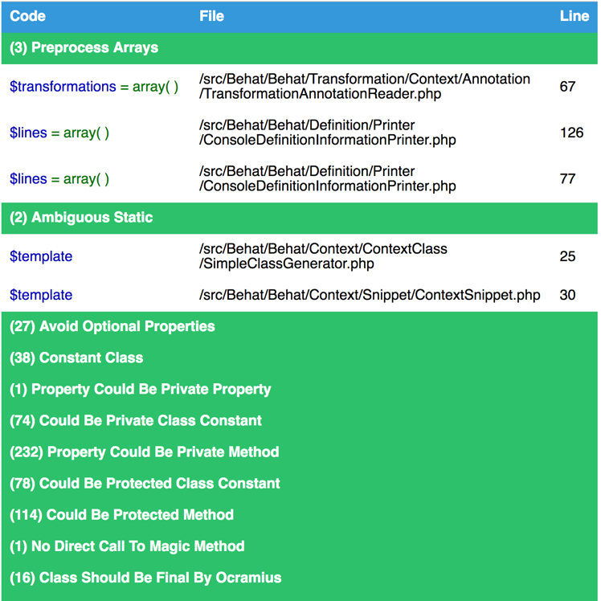
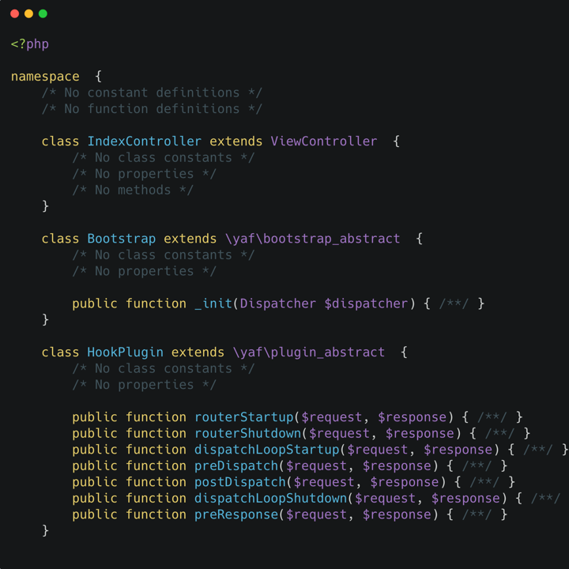
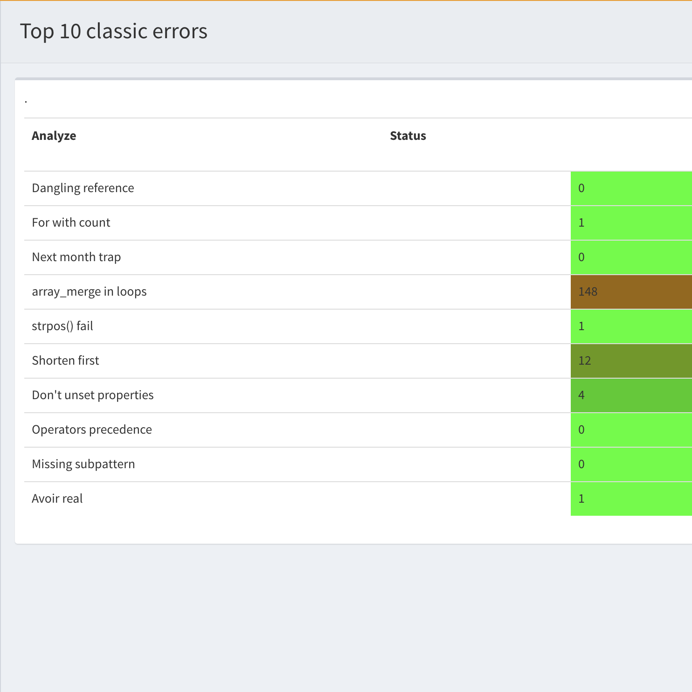
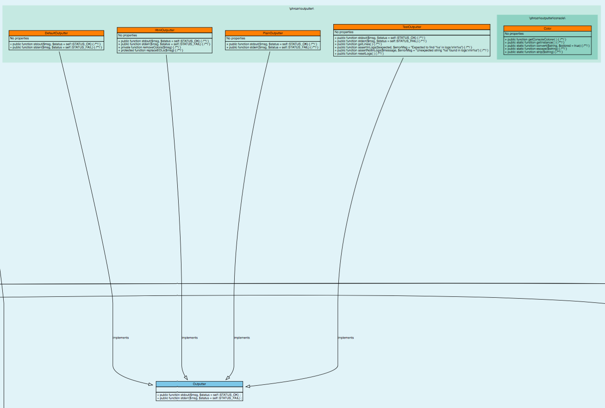

.. _Reports:

Reports
=======

Introduction
------------

Exakat provides multiple view to explore issue or metric generated by the rules.

Summary
-------

  * :ref:`Ambassador <report-ambassador>`
  * :ref:`BeautyCanon <report-beautycanon>`
  * :ref:`ClassReview <report-classreview>`
  * :ref:`Classes dependendies HTML <report-classes-dependendies-html>`
  * :ref:`Clustergrammer <report-clustergrammer>`
  * :ref:`Code Flower <report-code-flower>`
  * :ref:`Code Sniffer <report-code-sniffer>`
  * :ref:`CompatibilityPHP56 <report-compatibilityphp56>`
  * :ref:`CompatibilityPHP74 <report-compatibilityphp74>`
  * :ref:`CompatibilityPHP80 <report-compatibilityphp80>`
  * :ref:`CompatibilityPHP81 <report-compatibilityphp81>`
  * :ref:`CompatibilityPHP82 <report-compatibilityphp82>`
  * :ref:`CompatibilityPHP83 <report-compatibilityphp83>`
  * :ref:`Composer <report-composer>`
  * :ref:`Dependency Wheel <report-dependency-wheel>`
  * :ref:`Diplomat <report-diplomat>`
  * :ref:`Emissary <report-emissary>`
  * :ref:`Exakat Json <report-exakat-json>`
  * :ref:`Exakatyaml <report-exakatyaml>`
  * :ref:`File dependendies <report-file-dependendies>`
  * :ref:`File dependendies HTML <report-file-dependendies-html>`
  * :ref:`History <report-history>`
  * :ref:`Inventory <report-inventory>`
  * :ref:`Json <report-json>`
  * :ref:`Marmelab <report-marmelab>`
  * :ref:`Meters <report-meters>`
  * :ref:`Migration74 <report-migration74>`
  * :ref:`Migration80 <report-migration80>`
  * :ref:`Migration81 <report-migration81>`
  * :ref:`Migration82 <report-migration82>`
  * :ref:`Naming <report-naming>`
  * :ref:`None <report-none>`
  * :ref:`OneLiners <report-oneliners>`
  * :ref:`Owasp <report-owasp>`
  * :ref:`Perfile <report-perfile>`
  * :ref:`Perfule <report-perfule>`
  * :ref:`PhpCompilation <report-phpcompilation>`
  * :ref:`PhpConfiguration <report-phpconfiguration>`
  * :ref:`Phpcity <report-phpcity>`
  * :ref:`Phpcsfixer <report-phpcsfixer>`
  * :ref:`PlantUml <report-plantuml>`
  * :ref:`PublicAccess <report-publicaccess>`
  * :ref:`RadwellCode <report-radwellcode>`
  * :ref:`Rector <report-rector>`
  * :ref:`Sarb <report-sarb>`
  * :ref:`Sarif <report-sarif>`
  * :ref:`SimpleTable <report-simpletable>`
  * :ref:`Sonarcube <report-sonarcube>`
  * :ref:`Stats <report-stats>`
  * :ref:`Stubs <report-stubs>`
  * :ref:`StubsJson <report-stubsjson>`
  * :ref:`Text <report-text>`
  * :ref:`Top10 <report-top10>`
  * :ref:`Topology Order <report-topology-order>`
  * :ref:`TypeChecks <report-typechecks>`
  * :ref:`TypeSuggestion <report-typesuggestion>`
  * :ref:`Uml <report-uml>`
  * :ref:`Unused <report-unused>`
  * :ref:`Weekly <report-weekly>`
  * :ref:`Xml <report-xml>`
  * :ref:`Yaml <report-yaml>`

List of Reports
---------------

.. _report-ambassador:

Ambassador
++++++++++

Ambassador
__________

Ambassador is the most complete Exakat report. It used to be the default report, until Exakat 1.7.0

The Ambassador report many reports. 

+ Full configuration for the audit
+ Full documentation of the analysis
+ All results, searchable and browsable by file and analysis
+ Extra reports for 
    + Minor versions compatibility
    + PHP Directive usage
    + PHP compilation recommendations
    + Error messages list
    + List of processed files
    

.. image:: ../images/report.ambassador.png
    :alt: Example of a Ambassador report (0)

Ambassador includes the report from 3 other reports : PhpCompilation, PhpConfiguration, Stats.

Specs
_____

+--------------+---------------------------------------------------------------------------------------------------------------------------------------------------------------------------------------------------------------------------------------------------------------------------------------------------------------------------------------------------------------------------------------------------------------------------------------------------------------------------------------------------------------------------------------------------------------------------------+
| Short name   | Ambassador                                                                                                                                                                                                                                                                                                                                                                                                                                                                                                                                                                      |
+--------------+---------------------------------------------------------------------------------------------------------------------------------------------------------------------------------------------------------------------------------------------------------------------------------------------------------------------------------------------------------------------------------------------------------------------------------------------------------------------------------------------------------------------------------------------------------------------------------+
| Rulesets     | :ref:`ruleset-compatibilityphp53`, :ref:`ruleset-compatibilityphp54`, :ref:`ruleset-compatibilityphp55`, :ref:`ruleset-compatibilityphp56`, :ref:`ruleset-compatibilityphp70`, :ref:`ruleset-compatibilityphp71`, :ref:`ruleset-compatibilityphp72`, :ref:`ruleset-compatibilityphp73`, :ref:`ruleset-compatibilityphp74`, :ref:`ruleset-compatibilityphp80`, :ref:`ruleset-analyze`, :ref:`ruleset-preferences`, :ref:`ruleset-inventory`, :ref:`ruleset-performances`, :ref:`ruleset-appinfo`, :ref:`ruleset-dead-code`, :ref:`ruleset-security`, :ref:`ruleset-suggestions`. |
+--------------+---------------------------------------------------------------------------------------------------------------------------------------------------------------------------------------------------------------------------------------------------------------------------------------------------------------------------------------------------------------------------------------------------------------------------------------------------------------------------------------------------------------------------------------------------------------------------------+
| Type         | HTML                                                                                                                                                                                                                                                                                                                                                                                                                                                                                                                                                                            |
+--------------+---------------------------------------------------------------------------------------------------------------------------------------------------------------------------------------------------------------------------------------------------------------------------------------------------------------------------------------------------------------------------------------------------------------------------------------------------------------------------------------------------------------------------------------------------------------------------------+
| Target       | This report is written in 'report'.                                                                                                                                                                                                                                                                                                                                                                                                                                                                                                                                             |
+--------------+---------------------------------------------------------------------------------------------------------------------------------------------------------------------------------------------------------------------------------------------------------------------------------------------------------------------------------------------------------------------------------------------------------------------------------------------------------------------------------------------------------------------------------------------------------------------------------+
| Available in | `Entreprise Edition <https://www.exakat.io/entreprise-edition>`_                                                                                                                                                                                                                                                                                                                                                                                                                                                                                                                |
+--------------+---------------------------------------------------------------------------------------------------------------------------------------------------------------------------------------------------------------------------------------------------------------------------------------------------------------------------------------------------------------------------------------------------------------------------------------------------------------------------------------------------------------------------------------------------------------------------------+

.. _report-beautycanon:

BeautyCanon
+++++++++++

BeautyCanon
___________

The Beauty Canon report lists all rules that report no issues.

The Beauty Canon report displays one result per line. This report lists all issues in the provided ruleset that are reporting no error.

The title of the analysis is listed on the left, and the analysis short name is listed on the right, for further documentation.

This analysis uses Analysis as default rule. It may otherwise configured with the -T option.

::

    Compare Hash                                                           Security/CompareHash                    
    Configure Extract                                                      Security/ConfigureExtract               
    Dynamic Library Loading                                                Security/DynamicDl                      
    Encoded Simple Letters                                                 Security/EncodedLetters                 
    Indirect Injection                                                     Security/IndirectInjection              
    Integer Conversion                                                     Security/IntegerConversion              
    Minus One On Error                                                     Security/MinusOneOnError                
    Mkdir Default                                                          Security/MkdirDefault                   
    No ENT_IGNORE                                                          Security/NoEntIgnore                    
    No Hardcoded Hash                                                      Structures/NoHardcodedHash              
    No Hardcoded Ip                                                        Structures/NoHardcodedIp                
    No Hardcoded Port                                                      Structures/NoHardcodedPort              
    

Specs
_____

+--------------+------------------------------------------------------------------+
| Short name   | BeautyCanon                                                      |
+--------------+------------------------------------------------------------------+
| Rulesets     | This reports works with an arbitrary list of results.            |
|              |                                                                  |
|              |                                                                  |
+--------------+------------------------------------------------------------------+
| Type         | Text                                                             |
+--------------+------------------------------------------------------------------+
| Target       | This report is written to the standard output.                   |
+--------------+------------------------------------------------------------------+
| Available in | `Entreprise Edition <https://www.exakat.io/entreprise-edition>`_ |
+--------------+------------------------------------------------------------------+

.. _report-classreview:

ClassReview
+++++++++++

ClassReview
___________

The ClassReview report focuses on reviewing classes, traits and interfaces.

The ` :ref:`report-classreview` `` report focuses on good code hygiene for classes, interfaces, enumerations and traits. 

It checks the internal structure of classes, and suggest visibility, typehint updates.

.. image:: ../images/report.classreview.png
    :alt: Example of a ClassReview report (0)

Specs
_____

+--------------+------------------------------------------------------------------+
| Short name   | ClassReview                                                      |
+--------------+------------------------------------------------------------------+
| Rulesets     | ClassReview.                                                     |
+--------------+------------------------------------------------------------------+
| Type         | HTML                                                             |
+--------------+------------------------------------------------------------------+
| Target       | This report is written in 'classreview'.                         |
+--------------+------------------------------------------------------------------+
| Available in | `Entreprise Edition <https://www.exakat.io/entreprise-edition>`_ |
+--------------+------------------------------------------------------------------+

.. _report-classes-dependendies-html:

Classes dependendies HTML
+++++++++++++++++++++++++

Classes dependendies HTML
_________________________

This reports displays the class dependencies, based on definition usages.

This report displays all dependencies between classes, interfaces and traits. A class (or interface or trait) depends on another class (or interface or trait) when it makes usage of one of its definitions : extends, implements, use, and static calls. 

For example, `A` depends on `B`, because `A` extends `B`. 

The resulting diagram is in HTML file, which is readable with most browsers, from a web server. 

Warning : for browser security reasons, the report will NOT load as a local file. It needs to be served by an HTTP server, so all resources are correctly located.

Warning : large applications (> 1000 classes) will require a lot of resources to open.

.. image:: ../images/report.classdependencies.png
    :alt: Example of a Classes dependendies HTML report (0)

Specs
_____

+--------------+------------------------------------------------------------------+
| Short name   | Classes dependendies HTML                                        |
+--------------+------------------------------------------------------------------+
| Rulesets     | Classes dependendies HTML doesn't depend on rulesets.            |
|              |                                                                  |
|              |                                                                  |
+--------------+------------------------------------------------------------------+
| Type         | HTML                                                             |
+--------------+------------------------------------------------------------------+
| Target       | This report is written in 'class_dependencies'.                  |
+--------------+------------------------------------------------------------------+
| Available in | `Entreprise Edition <https://www.exakat.io/entreprise-edition>`_ |
+--------------+------------------------------------------------------------------+

.. _report-clustergrammer:

Clustergrammer
++++++++++++++

Clustergrammer
______________

The Clustergrammar report format data for a clustergrammer diagram.

` :ref:`report-clustergrammer` ` is a visualisation tool that may be found online. After generation of this report, a TEXT file is available in the project directory. Upload it on `http://amp.pharm.mssm.edu/clustergrammer/ <http://amp.pharm.mssm.edu/clustergrammer/>`_ to visualize it. 

See a live report here : `Clustergrammer <http://amp.pharm.mssm.edu/clustergrammer/viz_sim_mats/5a8d41bf3a82d32a9dacddd9/clustergrammer.txt>`_.

.. image:: ../images/report.clustergrammer.png
    :alt: Example of a Clustergrammer report (0)

Specs
_____

+--------------+------------------------------------------------------------------+
| Short name   | Clustergrammer                                                   |
+--------------+------------------------------------------------------------------+
| Rulesets     | Clustergrammer doesn't depend on rulesets.                       |
|              |                                                                  |
|              |                                                                  |
+--------------+------------------------------------------------------------------+
| Type         | TEXT                                                             |
+--------------+------------------------------------------------------------------+
| Target       | This report is written in 'clustergrammer.txt'.                  |
+--------------+------------------------------------------------------------------+
| Available in | `Entreprise Edition <https://www.exakat.io/entreprise-edition>`_ |
+--------------+------------------------------------------------------------------+

.. _report-code-flower:

Code Flower
+++++++++++

Code Flower
___________

The Code Flower represents hierarchies in a code source.

Codeflower is a javascript visualization of the code. It is based on Francois Zaninotto's `CodeFlower Source code visualization <http://www.redotheweb.com/CodeFlower/>`_.

It represents : 

+ Class hierarchy
+ Namespace hierarchy
+ Inclusion

.. image:: ../images/report.codeflower.png
    :alt: Example of a Code Flower report (0)

Specs
_____

+--------------+------------------------------------------------------------------+
| Short name   | Code Flower                                                      |
+--------------+------------------------------------------------------------------+
| Rulesets     | Code Flower doesn't depend on rulesets.                          |
|              |                                                                  |
|              |                                                                  |
+--------------+------------------------------------------------------------------+
| Type         | HTML                                                             |
+--------------+------------------------------------------------------------------+
| Target       | This report is written in 'codeflower'.                          |
+--------------+------------------------------------------------------------------+
| Available in | `Entreprise Edition <https://www.exakat.io/entreprise-edition>`_ |
+--------------+------------------------------------------------------------------+

.. _report-code-sniffer:

Code Sniffer
++++++++++++

Code Sniffer
____________

The CodeSniffer report exports in the CodeSniffer format.

This format reports analysis using the Codesniffer's result format. 

See also `Code Sniffer Report <https://github.com/squizlabs/PHP_CodeSniffer/wiki/Reporting>`_.

::

    FILE : /Path/To/View/The/File.php
    --------------------------------------------------------------------------------
    FOUND 3 ISSUES AFFECTING 3 LINES
    --------------------------------------------------------------------------------
     32 | MINOR | Could Use Alias
     41 | MINOR | Could Make A Function
     43 | MINOR | Could Make A Function
    --------------------------------------------------------------------------------
    

Specs
_____

+--------------+------------------------------------------------------------------+
| Short name   | Code Sniffer                                                     |
+--------------+------------------------------------------------------------------+
| Rulesets     | This reports works with an arbitrary list of results.            |
|              |                                                                  |
|              |                                                                  |
+--------------+------------------------------------------------------------------+
| Type         | TEXT                                                             |
+--------------+------------------------------------------------------------------+
| Target       | This report is written in 'exakat.txt'.                          |
+--------------+------------------------------------------------------------------+
| Available in | `Entreprise Edition <https://www.exakat.io/entreprise-edition>`_ |
+--------------+------------------------------------------------------------------+

.. _report-compatibilityphp56:

CompatibilityPHP56
++++++++++++++++++

CompatibilityPHP56
__________________

The CompatibilityPHP56 report list all detected issues with PHP 5.6 compatibility.

The CompatibilityPHP56 report displays one result per line, grouped by rule, and ordered by file and line number. Here is an example : 

::
    
   /path/from/project/root/to/file:line[space]name of analysis
   
   
This format is fast, and fitted for human review. It is the same format as PerRule. 

::

    ----------------------------------------------------------------------------------------------------
     Coalesce Equal (https://exakat.readthedocs.io/en/latest/Reference/Rules.html#php-coalesceequal)
    ----------------------------------------------------------------------------------------------------
     /src/Bridges/Tracy/BlueScreenPanel.php:25                    $blueScreen ??= Tracy\Debugger::getBlueScreen( )
     /src/Bridges/Tracy/LattePanel.php:32                         $bar ??= Tracy\Debugger::getBar( )      
     /src/Latte/Compiler/Lexer.php:371                            $type ??= $this->defaultSyntax          
     /src/Latte/Compiler/Nodes/FragmentNode.php:38                $this->line ??= $node->line             
     /src/Latte/Compiler/Parser.php:723                           $layer ??= $this->layer                 
     /src/Latte/Compiler/PhpWriter.php:137                        $uniq ??= '$' . bin2hex(random_bytes(5))
     /src/Latte/Compiler/PhpWriter.php:194                        $tokens ??= $this->tokens               
     /src/Latte/Extensions/Blueprint.php:83                       $native ??= (PHP_VERSION_ID >= 70400)   
     /src/Latte/Extensions/Filters.php:52                         $info->contentType ??= 'html'           
     /src/Latte/Runtime/Template.php:340                          $block ??= new Block                    
     /src/Latte/Runtime/Template.php:399                          $destId ??= $staticId                   
    ----------------------------------------------------------------------------------------------------
    
    
    ----------------------------------------------------------------------------------------------------
     Const Visibility Usage (https://exakat.readthedocs.io/en/latest/Reference/Rules.html#classes-constvisibilityusage)
    ----------------------------------------------------------------------------------------------------
     /src/Latte/Compiler/Lexer.php:26                             public const RE_STRING = '\'(?:\\\\.|[^\'\\\\])*+\'|"(?:\\\\.|[^"\\\\])*+"'
     /src/Latte/Compiler/Lexer.php:29                             public const RE_TAG_NAME = '[a-zA-Z][a-zA-Z0-9:_.-]*'
     /src/Latte/Compiler/Lexer.php:30                             public const RE_VALUE_NAME = '[^\p{C} "\'<>=`/{}]+'
     /src/Latte/Compiler/Lexer.php:31                             public const RE_INDENT = '((?<=\n|^)[ \t]+)?'
     /src/Latte/Compiler/Lexer.php:34                             public const N_PREFIX = 'n:'            
     /src/Latte/Compiler/Lexer.php:37                             public const STATE_PLAIN_TEXT = 'statePlain', STATE_HTML_TEXT = 'stateHtmlText'
     /src/Latte/Compiler/MacroTokens.php:18                       public const T_WHITESPACE = 1, T_COMMENT = 2, T_SYMBOL = 3, T_NUMBER = 4, T_VARIABLE = 5, T_STRING = 6, T_CAST = 7, T_KEYWORD = 8, T_CHAR = 9
     /src/Latte/Compiler/MacroTokens.php:29                       public const SIGNIFICANT = [self::T_SYMBOL, self::T_NUMBER, self::T_VARIABLE, self::T_STRING, self::T_CAST, self::T_KEYWORD, self::T_CHAR], NON_SIGNIFICANT = [self::T_COMMENT, self::T_WHITESPACE]
     /src/Latte/Compiler/NodeTraverser.php:15                     public const DONT_TRAVERSE_CHILDREN = 1 
     /src/Latte/Compiler/NodeTraverser.php:16                     public const STOP_TRAVERSAL = 2         
     /src/Latte/Compiler/Parser.php:30                            public const LOCATION_HEAD = 1, LOCATION_TEXT = 2, LOCATION_TAG = 3
     /src/Latte/Compiler/Tag.php:25                               public const PREFIX_INNER = 'inner', PREFIX_TAG = 'tag', PREFIX_NONE = ''
     /src/Latte/Compiler/Token.php:20                             public const TEXT = 'text'              
     /src/Latte/Compiler/Token.php:21                             public const WHITESPACE = 'whitespace'  
     /src/Latte/Compiler/Token.php:22                             public const SLASH = 'slash'            
     /src/Latte/Compiler/Token.php:23                             public const EQUALS = 'equals'          
     /src/Latte/Compiler/Token.php:24                             public const QUOTE = 'quote'            
     /src/Latte/Compiler/Token.php:26                             public const LATTE_TAG_OPEN = 'latteTagOpen'
     /src/Latte/Compiler/Token.php:27                             public const LATTE_TAG_END = 'latteTagEnd'
     /src/Latte/Compiler/Token.php:28                             public const LATTE_NAME = 'latteName'   
     /src/Latte/Compiler/Token.php:29                             public const LATTE_ARGS = 'latteArgs'   
     /src/Latte/Compiler/Token.php:30                             public const LATTE_COMMENT_OPEN = 'latteCommentOpen'
     /src/Latte/Compiler/Token.php:31                             public const LATTE_COMMENT_CLOSE = 'latteCommentClose'
     /src/Latte/Compiler/Token.php:33                             public const HTML_TAG_OPEN = 'htmlTagOpen'
     /src/Latte/Compiler/Token.php:34                             public const HTML_TAG_CLOSE = 'htmlTagClose'
     /src/Latte/Compiler/Token.php:35                             public const HTML_COMMENT_OPEN = 'htmlCommentOpen'
     /src/Latte/Compiler/Token.php:36                             public const HTML_COMMENT_CLOSE = 'htmlCommentClose'
     /src/Latte/Compiler/Token.php:37                             public const HTML_BOGUS_TAG_OPEN = 'htmlBogusTagOpen'
     /src/Latte/Compiler/Token.php:38                             public const HTML_NAME = 'htmlName'     
     /src/Latte/Compiler/Tokenizer.php:25                         public const VALUE = 0, OFFSET = 1, TYPE = 2
     /src/Latte/Context.php:19                                    public const TEXT = 'text', HTML = 'html', XML = 'xml', JS = 'js', CSS = 'css', ICAL = 'ical'
     /src/Latte/Context.php:27                                    public const HTML_TEXT = null, HTML_COMMENT = 'Comment', HTML_BOGUSTAG = 'Bogus', HTML_CSS = 'Css', HTML_JS = 'Js', HTML_TAG = 'Tag', HTML_ATTRIBUTE = 'Attr', HTML_ATTRIBUTE_JS = 'AttrJs', HTML_ATTRIBUTE_CSS = 'AttrCss', HTML_ATTRIBUTE_URL = 'AttrUrl', HTML_ATTRIBUTE_UNQUOTED = 'Unquoted'
     /src/Latte/Context.php:40                                    public const XML_TEXT = null, XML_COMMENT = 'Comment', XML_BOGUSTAG = 'Bogus', XML_TAG = 'Tag', XML_ATTRIBUTE = 'Attr'
     /src/Latte/Engine.php:20                                     public const VERSION = '3.0.0-dev'      
     /src/Latte/Engine.php:21                                     public const VERSION_ID = 30000         
     /src/Latte/Engine.php:24                                     public const CONTENT_HTML = Context::HTML, CONTENT_XML = Context::XML, CONTENT_JS = Context::JS, CONTENT_CSS = Context::CSS, CONTENT_ICAL = Context::ICAL, CONTENT_TEXT = Context::TEXT
     /src/Latte/Runtime/SnippetDriver.php:23                      public const TYPE_STATIC = 'static', TYPE_DYNAMIC = 'dynamic', TYPE_AREA = 'area'
     /src/Latte/Runtime/Template.php:24                           public const LAYER_TOP = 0, LAYER_SNIPPET = 'snippet', LAYER_LOCAL = 'local'
     /src/Latte/Runtime/Template.php:29                           protected const CONTENT_TYPE = Latte\Context::HTML
     /src/Latte/Runtime/Template.php:31                           protected const BLOCKS = [ ]            
     /src/Latte/Sandbox/SecurityPolicy.php:22                     public const ALL = ['*']                
     /src/Latte/exceptions.php:45                                 public const MESSAGES = [PREG_INTERNAL_ERROR => 'Internal error', PREG_BACKTRACK_LIMIT_ERROR => 'Backtrack limit was exhausted', PREG_RECURSION_LIMIT_ERROR => 'Recursion limit was exhausted', PREG_BAD_UTF8_ERROR => 'Malformed UTF-8 data', PREG_BAD_UTF8_OFFSET_ERROR => 'Offset didn\'t correspond to the begin of a valid UTF-8 code point', 6 => 'Failed due to limited JIT stack space',  ]
    ----------------------------------------------------------------------------------------------------
    
    ----------------------------------------------------------------------------------------------------
     Generator Cannot Return (https://exakat.readthedocs.io/en/latest/Reference/Rules.html#functions-generatorcannotreturn)
    ----------------------------------------------------------------------------------------------------
     /src/Latte/Compiler/Lexer.php:321                            private function match(string $re) : \Generator { /**/ } 
     /src/Latte/Compiler/Node.php:21                              public function &getIterator( ) : \Generator { /**/ } 
     /src/Latte/Extensions/CoreExtension.php:229                  public function parseSyntax(Tag $tag, Parser $parser) : \Generator { /**/ } 
     /src/Latte/Extensions/Nodes/BlockNode.php:37                 public static function parse(Tag $tag, Parser $parser) : \Generator { /**/ } 
     /src/Latte/Extensions/Nodes/CaptureNode.php:33               public static function parse(Tag $tag) : \Generator { /**/ } 
     /src/Latte/Extensions/Nodes/DefineNode.php:36                public static function parse(Tag $tag, Parser $parser) : \Generator { /**/ } 
     /src/Latte/Extensions/Nodes/EmbedNode.php:38                 public static function parse(Tag $tag, Parser $parser) : \Generator { /**/ } 
     /src/Latte/Extensions/Nodes/FirstLastSepNode.php:36          public static function parse(Tag $tag) : \Generator { /**/ } 
     /src/Latte/Extensions/Nodes/ForNode.php:31                   public static function parse(Tag $tag) : \Generator { /**/ } 
     /src/Latte/Extensions/Nodes/ForeachNode.php:37               public static function parse(Tag $tag) : \Generator { /**/ } 
     /src/Latte/Extensions/Nodes/IfChangedNode.php:32             public static function parse(Tag $tag) : \Generator { /**/ } 
     /src/Latte/Extensions/Nodes/IfContentNode.php:33             public static function parse(Tag $tag, Parser $parser) : \Generator { /**/ } 
     /src/Latte/Extensions/Nodes/IfNode.php:40                    public static function parse(Tag $tag, Parser $parser) : \Generator { /**/ } 
     /src/Latte/Extensions/Nodes/IterateWhileNode.php:34          public static function parse(Tag $tag) : \Generator { /**/ } 
     /src/Latte/Extensions/Nodes/SnippetAreaNode.php:36           public static function parse(Tag $tag, Parser $parser) : \Generator { /**/ } 
     /src/Latte/Extensions/Nodes/SnippetNode.php:41               public static function parse(Tag $tag, Parser $parser) : \Generator { /**/ } 
     /src/Latte/Extensions/Nodes/SpacelessNode.php:30             public static function parse(Tag $tag) : \Generator { /**/ } 
     /src/Latte/Extensions/Nodes/SwitchNode.php:32                public static function parse(Tag $tag) : \Generator { /**/ } 
     /src/Latte/Extensions/Nodes/TranslateNode.php:34             public static function parse(Tag $tag, Parser $parser) : \Generator { /**/ } 
     /src/Latte/Extensions/Nodes/TryNode.php:30                   public static function parse(Tag $tag) : \Generator { /**/ } 
     /src/Latte/Extensions/Nodes/WhileNode.php:32                 public static function parse(Tag $tag) : \Generator { /**/ } 
    ----------------------------------------------------------------------------------------------------
    
    
    ----------------------------------------------------------------------------------------------------
     List Short Syntax (https://exakat.readthedocs.io/en/latest/Reference/Rules.html#php-listshortsyntax)
    ----------------------------------------------------------------------------------------------------
     /src/Latte/Compiler/Parser.php:311                           [$prevDepth, $this->htmlDepth]          
     /src/Latte/Compiler/Parser.php:644                           [$gen, $line]                           
     /src/Latte/Compiler/PhpHelpers.php:35                        [$name, $token]                         
     /src/Latte/Compiler/PhpWriter.php:85                         [ , $l, $source, $format, $cond, $r]    
     /src/Latte/Compiler/PhpWriter.php:865                        [$contentType, $context, $flag]         
     /src/Latte/Compiler/PhpWriter.php:866                        [$lq, $rq]                              
     /src/Latte/Compiler/Tokenizer.php:76                         [$line, $col]                           
     /src/Latte/Extensions/CoreExtension.php:233                  [$inner]                                
     /src/Latte/Extensions/CoreExtension.php:247                  [$name, $mod]                           
     /src/Latte/Extensions/Nodes/BlockNode.php:40                 [$name, $local]                         
     /src/Latte/Extensions/Nodes/BlockNode.php:53                 [$node->content]                        
     /src/Latte/Extensions/Nodes/CaptureNode.php:42               [$node->content]                        
     /src/Latte/Extensions/Nodes/DefineNode.php:39                [$name, $local]                         
     /src/Latte/Extensions/Nodes/DefineNode.php:49                [$node->content]                        
     /src/Latte/Extensions/Nodes/EmbedNode.php:43                 [$node->name, $mode]                    
     /src/Latte/Extensions/Nodes/EmbedNode.php:50                 [$node->blocks]                         
     /src/Latte/Extensions/Nodes/FirstLastSepNode.php:51          [$node->then, $nextTag]                 
     /src/Latte/Extensions/Nodes/FirstLastSepNode.php:54          [$node->else]                           
     /src/Latte/Extensions/Nodes/ForNode.php:36                   [$node->content]                        
     /src/Latte/Extensions/Nodes/ForeachNode.php:57               [$node->content, $nextTag]              
     /src/Latte/Extensions/Nodes/ForeachNode.php:60               [$node->else]                           
     /src/Latte/Extensions/Nodes/IfChangedNode.php:43             [$node->then, $nextTag]                 
     /src/Latte/Extensions/Nodes/IfChangedNode.php:46             [$node->else]                           
     /src/Latte/Extensions/Nodes/IfContentNode.php:38             [$node->content]                        
     /src/Latte/Extensions/Nodes/IfNode.php:158                   [$name, $block]                         
     /src/Latte/Extensions/Nodes/IfNode.php:54                    [$node->then, $nextTag]                 
     /src/Latte/Extensions/Nodes/IfNode.php:61                    [$node->else, $nextTag]                 
     /src/Latte/Extensions/Nodes/IncludeBlockNode.php:40          [$name]                                 
     /src/Latte/Extensions/Nodes/IncludeFileNode.php:37           [$node->file]                           
     /src/Latte/Extensions/Nodes/IterateWhileNode.php:49          [$node->content, $nextTag]              
     /src/Latte/Extensions/Nodes/SnippetAreaNode.php:44           [$node->content]                        
     /src/Latte/Extensions/Nodes/SnippetNode.php:85               [$node->content]                        
     /src/Latte/Extensions/Nodes/SpacelessNode.php:34             [$node->content]                        
     /src/Latte/Extensions/Nodes/SwitchNode.php:109               [&$case, &$stmt]                        
     /src/Latte/Extensions/Nodes/SwitchNode.php:43                [$content, $nextTag]                    
     /src/Latte/Extensions/Nodes/SwitchNode.php:55                [$content, $nextTag]                    
     /src/Latte/Extensions/Nodes/SwitchNode.php:63                [$content, $nextTag]                    
     /src/Latte/Extensions/Nodes/SwitchNode.php:82                [$condition, $stmt]                     
     /src/Latte/Extensions/Nodes/TranslateNode.php:48             [$node->content]                        
     /src/Latte/Extensions/Nodes/TryNode.php:40                   [$node->try, $nextTag]                  
     /src/Latte/Extensions/Nodes/TryNode.php:43                   [$node->else]                           
     /src/Latte/Extensions/Nodes/WhileNode.php:41                 [$node->content, $nextTag]              
     /src/Latte/Runtime/FilterExecutor.php:119                    [$callback, $aware]                     
     /src/Latte/Runtime/FilterExecutor.php:67                     [$callback, $aware]                     
     /src/Latte/Runtime/SnippetDriver.php:76                      [$name, $obStarted]                     
     /src/Latte/Runtime/Template.php:402                          [$method, $contentType]                 
    ----------------------------------------------------------------------------------------------------
    

Specs
_____

+--------------+------------------------------------------------------------------+
| Short name   | CompatibilityPHP56                                               |
+--------------+------------------------------------------------------------------+
| Rulesets     | CompatibilityPHP56.                                              |
+--------------+------------------------------------------------------------------+
| Type         | Text                                                             |
+--------------+------------------------------------------------------------------+
| Target       | This report is written in 'stdout'.                              |
+--------------+------------------------------------------------------------------+
| Available in | `Entreprise Edition <https://www.exakat.io/entreprise-edition>`_ |
+--------------+------------------------------------------------------------------+

.. _report-compatibilityphp74:

CompatibilityPHP74
++++++++++++++++++

CompatibilityPHP74
__________________

The CompatibilityPHP74 report list all detected issues with PHP 7.4 compatibility.

The CompatibilityPHP74 report displays one result per line, grouped by rule, and ordered by file and line number. Here is an example : 

::
    
   /path/from/project/root/to/file:line[space]name of analysis
   
   
This format is fast, and fitted for human review. It is the same format as PerRule. 

::

    ----------------------------------------------------------------------------------------------------
     PHP 7.4 Removed Functions (https://exakat.readthedocs.io/en/latest/Reference/Rules.html#php-php74removedfunctions)
    ----------------------------------------------------------------------------------------------------
     /src/wp-includes/ID3/getid3.php:443                          get_magic_quotes_runtime( )             
    ----------------------------------------------------------------------------------------------------
    
    ----------------------------------------------------------------------------------------------------
     idn_to_ascii() New Default (https://exakat.readthedocs.io/en/latest/Reference/Rules.html#php-idnuts46)
    ----------------------------------------------------------------------------------------------------
     /src/wp-includes/PHPMailer/PHPMailer.php:1468                idn_to_ascii($domain, $errorcode)       
    ----------------------------------------------------------------------------------------------------
    

Specs
_____

+--------------+------------------------------------------------------------------+
| Short name   | CompatibilityPHP74                                               |
+--------------+------------------------------------------------------------------+
| Rulesets     | CompatibilityPHP74.                                              |
+--------------+------------------------------------------------------------------+
| Type         | Text                                                             |
+--------------+------------------------------------------------------------------+
| Target       | This report is written in 'stdout'.                              |
+--------------+------------------------------------------------------------------+
| Available in | `Entreprise Edition <https://www.exakat.io/entreprise-edition>`_ |
+--------------+------------------------------------------------------------------+

.. _report-compatibilityphp80:

CompatibilityPHP80
++++++++++++++++++

CompatibilityPHP80
__________________

The CompatibilityPHP80 report list all detected issues with PHP 8.0 compatibility.

The CompatibilityPHP80 report displays one result per line, grouped by rule, and ordered by file and line number. Here is an example : 

::
    
   /path/from/project/root/to/file:line[space]name of analysis
   
   
This format is fast, and fitted for human review. It is the same format as PerRule. 

::

    
    ----------------------------------------------------------------------------------------------------
     PHP 8.0 Resources Turned Into Objects (https://exakat.readthedocs.io/en/latest/Reference/Rules.html#php-php80removesresources)
    ----------------------------------------------------------------------------------------------------
     /src/wp-includes/Requests/Transport/cURL.php:116             is_resource($this->handle)              
    ----------------------------------------------------------------------------------------------------
    
    
    ----------------------------------------------------------------------------------------------------
     PHP 80 Named Parameter Variadic (https://exakat.readthedocs.io/en/latest/Reference/Rules.html#php-php80namedparametervariadic)
    ----------------------------------------------------------------------------------------------------
     /src/wp-includes/capabilities.php:44                         function map_meta_cap($cap, $user_id, ...$args) { /**/ } 
     /src/wp-includes/class-wp-walker.php:286                     public function paged_walk($elements, $max_depth, $page_num, $per_page, ...$args) { /**/ } 
     /src/wp-includes/functions.php:1108                          function add_query_arg(...$args) { /**/ } 
     /src/wp-includes/plugin.php:439                              function do_action($hook_name, ...$arg) { /**/ } 
     /src/wp-includes/theme.php:2568                              function add_theme_support($feature, ...$args) { /**/ } 
     /src/wp-includes/theme.php:2899                              function get_theme_support($feature, ...$args) { /**/ } 
     /src/wp-includes/theme.php:3029                              function current_theme_supports($feature, ...$args) { /**/ } 
     /src/wp-includes/wp-db.php:1395                              public function prepare($query, ...$args) { /**/ } 
    ----------------------------------------------------------------------------------------------------
    

Specs
_____

+--------------+------------------------------------------------------------------+
| Short name   | CompatibilityPHP80                                               |
+--------------+------------------------------------------------------------------+
| Rulesets     | CompatibilityPHP80.                                              |
+--------------+------------------------------------------------------------------+
| Type         | Text                                                             |
+--------------+------------------------------------------------------------------+
| Target       | This report is written in 'stdout'.                              |
+--------------+------------------------------------------------------------------+
| Available in | `Entreprise Edition <https://www.exakat.io/entreprise-edition>`_ |
+--------------+------------------------------------------------------------------+

.. _report-compatibilityphp81:

CompatibilityPHP81
++++++++++++++++++

CompatibilityPHP81
__________________

The CompatibilityPHP56 report list all detected issues with PHP 8.1 compatibility.

The CompatibilityPHP81 report displays one result per line, grouped by rule, and ordered by file and line number. Here is an example : 

::
    
   /path/from/project/root/to/file:line[space]name of analysis
   
   
This format is fast, and fitted for human review. It is the same format as PerRule. 

::

    
    ----------------------------------------------------------------------------------------------------
     PHP 8.1 Removed Directives (https://exakat.readthedocs.io/en/latest/Reference/Rules.html#php-php81removeddirective)
    ----------------------------------------------------------------------------------------------------
     /src/wp-includes/pomo/po.php:24                              @ini_set('auto_detect_line_endings', 1) 
    ----------------------------------------------------------------------------------------------------
    
    
    ----------------------------------------------------------------------------------------------------
     PHP Native Class Type Compatibility (https://exakat.readthedocs.io/en/latest/Reference/Rules.html#php-nativeclasstypecompatibility)
    ----------------------------------------------------------------------------------------------------
     /src/wp-includes/Requests/Cookie/Jar.php:102                 public function offsetUnset($key) { /**/ } 
     /src/wp-includes/Requests/Cookie/Jar.php:63                  public function offsetExists($key) { /**/ } 
     /src/wp-includes/Requests/Cookie/Jar.php:73                  public function offsetGet($key) { /**/ } 
     /src/wp-includes/Requests/Cookie/Jar.php:89                  public function offsetSet($key, $value) { /**/ } 
     /src/wp-includes/Requests/Response/Headers.php:26            public function offsetGet($key) { /**/ } 
     /src/wp-includes/Requests/Response/Headers.php:43            public function offsetSet($key, $value) { /**/ } 
     /src/wp-includes/Requests/Utility/CaseInsensitiveDictionary.php:40 public function offsetExists($key) { /**/ } 
     /src/wp-includes/Requests/Utility/CaseInsensitiveDictionary.php:51 public function offsetGet($key) { /**/ } 
     /src/wp-includes/Requests/Utility/CaseInsensitiveDictionary.php:68 public function offsetSet($key, $value) { /**/ } 
     /src/wp-includes/Requests/Utility/CaseInsensitiveDictionary.php:82 public function offsetUnset($key) { /**/ } 
     /src/wp-includes/Requests/Utility/FilteredIterator.php:40    public function current( ) { /**/ }     
     /src/wp-includes/Requests/Utility/FilteredIterator.php:53    public function unserialize($serialized) { /**/ } 
     /src/wp-includes/Requests/Utility/FilteredIterator.php:53    public function unserialize($serialized) { /**/ } 
     /src/wp-includes/sodium_compat/src/PHP52/SplFixedArray.php:103 public function offsetGet($index) { /**/ } 
     /src/wp-includes/sodium_compat/src/PHP52/SplFixedArray.php:114 public function offsetSet($index, $newval) { /**/ } 
     /src/wp-includes/sodium_compat/src/PHP52/SplFixedArray.php:122 public function offsetUnset($index) { /**/ } 
     /src/wp-includes/sodium_compat/src/PHP52/SplFixedArray.php:35 public function count( ) { /**/ }       
     /src/wp-includes/sodium_compat/src/PHP52/SplFixedArray.php:94 public function offsetExists($index) { /**/ } 
    ----------------------------------------------------------------------------------------------------

Specs
_____

+--------------+------------------------------------------------------------------+
| Short name   | CompatibilityPHP81                                               |
+--------------+------------------------------------------------------------------+
| Rulesets     | CompatibilityPHP81.                                              |
+--------------+------------------------------------------------------------------+
| Type         | Text                                                             |
+--------------+------------------------------------------------------------------+
| Target       | This report is written in 'stdout'.                              |
+--------------+------------------------------------------------------------------+
| Available in | `Entreprise Edition <https://www.exakat.io/entreprise-edition>`_ |
+--------------+------------------------------------------------------------------+

.. _report-compatibilityphp82:

CompatibilityPHP82
++++++++++++++++++

CompatibilityPHP82
__________________

The CompatibilityPHP82 report list all detected issues with PHP 8.2 compatibility.

The CompatibilityPHP82 report displays one result per line, grouped by rule, and ordered by file and line number. Here is an example : 

::
    
   /path/from/project/root/to/file:line[space]name of analysis
   
   
This format is fast, and fitted for human review. It is the same format as PerRule. 

::

    ----------------------------------------------------------------------------------------------------
     Checks Property Existence (https://exakat.readthedocs.io/en/latest/Reference/Rules.html#classes-checkspropertyexistence)
    ----------------------------------------------------------------------------------------------------
     /app/Domain/Service/Project/ProjectIssue/Update.php:31       isset($params->tags)                    
     /app/Domain/Service/Project/ProjectIssue/Update.php:35       isset($params->releases)                
     /app/Domain/Service/Project/ProjectIssue/Update.php:39       isset($params->modules)                 
     /app/Domain/Service/Project/ProjectIssue/Update.php:43       isset($params->content)                 
     /app/Domain/Service/Project/ProjectIssue/Update.php:47       isset($params->completed)               
     /app/Domain/Service/Project/ProjectIssue/Update.php:49       isset($params->completedDate)           
     /app/Domain/Service/Project/ProjectRelease/UpdateParams.php:42 isset($this->completedDate)             
    ----------------------------------------------------------------------------------------------------
    
    
    ----------------------------------------------------------------------------------------------------
     Undefined Properties (https://exakat.readthedocs.io/en/latest/Reference/Rules.html#classes-undefinedproperty)
    ----------------------------------------------------------------------------------------------------
     /app/Controller/Api/V1/Attachment/Upload.php:36              $request->files                         
     /app/Controller/Api/V1/Login/Code.php:39                     $request->query                         
     /app/Controller/BaseBrand.php:103                            $this->in                               
     /app/Controller/BaseBrand.php:115                            $this->in                               
     /app/Controller/BaseBrand.php:120                            $this->in                               
     /app/Controller/BaseBrand.php:132                            $this->in                               
     /app/Controller/BaseBrand.php:137                            $this->in                               
     ----------------------------------------------------------------------------------------------------
    

Specs
_____

+--------------+------------------------------------------------------------------+
| Short name   | CompatibilityPHP82                                               |
+--------------+------------------------------------------------------------------+
| Rulesets     | CompatibilityPHP82.                                              |
+--------------+------------------------------------------------------------------+
| Type         | Text                                                             |
+--------------+------------------------------------------------------------------+
| Target       | This report is written in 'stdout'.                              |
+--------------+------------------------------------------------------------------+
| Available in | `Entreprise Edition <https://www.exakat.io/entreprise-edition>`_ |
+--------------+------------------------------------------------------------------+

.. _report-compatibilityphp83:

CompatibilityPHP83
++++++++++++++++++

CompatibilityPHP83
__________________

The CompatibilityPHP83 report list all detected issues with PHP 8.2 compatibility.

The CompatibilityPHP83 report displays one result per line, grouped by rule, and ordered by file and line number. Here is an example : 

::
    
   /path/from/project/root/to/file:line[space]name of analysis
   
   
This format is fast, and fitted for human review. It is the same format as PerRule. 

::

    ----------------------------------------------------------------------------------------------------
    New Functions In PHP 8.3 (https://exakat.readthedocs.io/en/latest/Reference/Rules.html#php-php83newfunctions)
    ----------------------------------------------------------------------------------------------------
    
    ----------------------------------------------------------------------------------------------------
    

Specs
_____

+--------------+------------------------------------------------------------------+
| Short name   | CompatibilityPHP83                                               |
+--------------+------------------------------------------------------------------+
| Rulesets     | CompatibilityPHP83.                                              |
+--------------+------------------------------------------------------------------+
| Type         | Text                                                             |
+--------------+------------------------------------------------------------------+
| Target       | This report is written in 'stdout'.                              |
+--------------+------------------------------------------------------------------+
| Available in | `Entreprise Edition <https://www.exakat.io/entreprise-edition>`_ |
+--------------+------------------------------------------------------------------+

.. _report-composer:

Composer
++++++++

Composer
________

The Composer report provide elements for the require attribute in the composer.json.

It helps documenting the composer.json, by providing more information, extracted from the code.

This report makes a copy then updates the composer.json, when available; otherwise, it creates a totally new composer.json. 

The report provides a calculated value for "php": "^7.3" and all the identified PHP extensions (such as "ext-exif", "ext-gd", "ext-finfo", etc). Core PHP extensions are omitted. 

It is recommended to review manually the results of the suggested composer.json before using it.

::

    Name,File,Line
    0,/features/bootstrap/FeatureContext.php,61
    10000,/features/bootstrap/FeatureContext.php,61
    777,/features/bootstrap/FeatureContext.php,63
    20,/features/bootstrap/FeatureContext.php,73
    0,/features/bootstrap/FeatureContext.php,334
    0,/features/bootstrap/FeatureContext.php,339
    0,/features/bootstrap/FeatureContext.php,344
    0,/features/bootstrap/FeatureContext.php,362
    0,/features/bootstrap/FeatureContext.php,366
    0,/features/bootstrap/FeatureContext.php,368
    0,/features/bootstrap/FeatureContext.php,372
    777,/features/bootstrap/FeatureContext.php,423
    777,/features/bootstrap/FeatureContext.php,431
    0,/src/Behat/Behat/Context/ContextClass/SimpleClassGenerator.php,68
    1,/src/Behat/Behat/Context/ContextClass/SimpleClassGenerator.php,69
    0,/src/Behat/Behat/Context/Environment/InitializedContextEnvironment.php,84
    0,/src/Behat/Behat/Context/Environment/InitializedContextEnvironment.php,150
    

Specs
_____

+--------------+------------------------------------------------------------------+
| Short name   | Composer                                                         |
+--------------+------------------------------------------------------------------+
| Rulesets     | Appinfo.                                                         |
+--------------+------------------------------------------------------------------+
| Type         | JSON                                                             |
+--------------+------------------------------------------------------------------+
| Target       | This report is written in 'composer.json'.                       |
+--------------+------------------------------------------------------------------+
| Available in | `Entreprise Edition <https://www.exakat.io/entreprise-edition>`_ |
+--------------+------------------------------------------------------------------+

.. _report-dependency-wheel:

Dependency Wheel
++++++++++++++++

Dependency Wheel
________________

The DependencyWheel represents dependencies in a code source.

Dependency Wheel is a javascript visualization of the classes dependencies in the code. Every class, interface and trait are represented as a circle, and every relation between the classes are represented by a link between them, inside the circle. 

It is based on Francois Zaninotto's `DependencyWheel <http://fzaninotto.github.com/DependencyWheel>`_ and the `d3.js <https://github.com/mbostock/d3>`_.

.. image:: ../images/report.dependencywheel.png
    :alt: Example of a Dependency Wheel report (0)

Specs
_____

+--------------+------------------------------------------------------------------+
| Short name   | Dependency Wheel                                                 |
+--------------+------------------------------------------------------------------+
| Rulesets     | Dependency Wheel doesn't depend on rulesets.                     |
|              |                                                                  |
|              |                                                                  |
+--------------+------------------------------------------------------------------+
| Type         | HTML                                                             |
+--------------+------------------------------------------------------------------+
| Target       | This report is written in 'wheel'.                               |
+--------------+------------------------------------------------------------------+
| Available in | `Entreprise Edition <https://www.exakat.io/entreprise-edition>`_ |
+--------------+------------------------------------------------------------------+

.. _report-diplomat:

Diplomat
++++++++

Diplomat
________

The Diplomat is the default human readable report.

The Diplomat report is the default report since Exakat 1.7.0. It is a light version of the Ambassador report, and uses a shorter list of analysis. 

Specs
_____

+--------------+---------------------------------------------------------------------------------------------------------------------------------------------------------------------------------------------------------------------------------------------------------------------------------------------------------------------------------------------------------------------------------------------------------------------------------------------------------------------+
| Short name   | Diplomat                                                                                                                                                                                                                                                                                                                                                                                                                                                            |
+--------------+---------------------------------------------------------------------------------------------------------------------------------------------------------------------------------------------------------------------------------------------------------------------------------------------------------------------------------------------------------------------------------------------------------------------------------------------------------------------+
| Rulesets     | :ref:`ruleset-compatibilityphp53`, :ref:`ruleset-compatibilityphp54`, :ref:`ruleset-compatibilityphp55`, :ref:`ruleset-compatibilityphp56`, :ref:`ruleset-compatibilityphp70`, :ref:`ruleset-compatibilityphp71`, :ref:`ruleset-compatibilityphp72`, :ref:`ruleset-compatibilityphp73`, :ref:`ruleset-compatibilityphp74`, :ref:`ruleset-compatibilityphp80`, :ref:`ruleset-top10`, :ref:`ruleset-preferences`, :ref:`ruleset-appinfo`, :ref:`ruleset-suggestions`. |
+--------------+---------------------------------------------------------------------------------------------------------------------------------------------------------------------------------------------------------------------------------------------------------------------------------------------------------------------------------------------------------------------------------------------------------------------------------------------------------------------+
| Type         | HTML                                                                                                                                                                                                                                                                                                                                                                                                                                                                |
+--------------+---------------------------------------------------------------------------------------------------------------------------------------------------------------------------------------------------------------------------------------------------------------------------------------------------------------------------------------------------------------------------------------------------------------------------------------------------------------------+
| Target       | This report is written in 'diplomat'.                                                                                                                                                                                                                                                                                                                                                                                                                               |
+--------------+---------------------------------------------------------------------------------------------------------------------------------------------------------------------------------------------------------------------------------------------------------------------------------------------------------------------------------------------------------------------------------------------------------------------------------------------------------------------+
| Available in | `Entreprise Edition <https://www.exakat.io/entreprise-edition>`_, `Community Edition <https://www.exakat.io/community-edition>`_                                                                                                                                                                                                                                                                                                                                    |
+--------------+---------------------------------------------------------------------------------------------------------------------------------------------------------------------------------------------------------------------------------------------------------------------------------------------------------------------------------------------------------------------------------------------------------------------------------------------------------------------+

.. _report-emissary:

Emissary
++++++++

Emissary
________

Emissary is the template for other HTML reports : Ambassador and Diplomat

The Emissary report is not to be used directly. Use Ambassador or Diplomat instead.

Emissary includes the report from 3 other reports : PhpCompilation, PhpConfiguration, Stats.

Specs
_____

+--------------+------------------------------------------------------------------+
| Short name   | Emissary                                                         |
+--------------+------------------------------------------------------------------+
| Rulesets     | This reports works with an arbitrary list of results.            |
|              |                                                                  |
|              |                                                                  |
+--------------+------------------------------------------------------------------+
| Type         | HTML                                                             |
+--------------+------------------------------------------------------------------+
| Target       | This report is written in 'report'.                              |
+--------------+------------------------------------------------------------------+
| Available in | `Entreprise Edition <https://www.exakat.io/entreprise-edition>`_ |
+--------------+------------------------------------------------------------------+

.. _report-exakat-json:

Exakat Json
+++++++++++

Exakat Json
___________

The Exakat JSON report exports in a flat JSON format.

Simple Json format. It is a flat array of objects, all with the same structure.

::

    [
      {
        "exakatVersion": "2.2.2",
        "exakatFingerprint": "f93c98ed693f29abc75b52154482ac4f6ff1b59b",
        "analyzedAt": "2021-09-10T16:59:20+00:00",
        "uuid": "1234567abcd",
        "project": "sculpin",
        "branch": "master",
        "lastCommitId": "b7c9027f05d9bff4dc6e92f36d29c4738bfc0b42",
        "ruleId": "Classes\/ChildRemoveTypehint",
        "type": "warning",
        "severity": "major",
        "fixable": "fixable",
        "file": "\/src\/Sculpin\/Core\/Source\/SourceInterface.php",
        "namespace": "\sculpin\core\source",
        "class": "",
        "function": "",
        "message": "Child Class Removes Typehint",
        "startLine": 144,
        "endLine": 144,
        "fullCode": "public function duplicate(string $newSourceId) : SourceInterface ;",
      },
    
    ]

This Report may be configured with the [Exakatjson] section, to provide the uuid value.

::

    [Exakatjson]
    uuid=1234567abcd;

Specs
_____

+--------------+-------------------------------------------------------------------------------------------------------------------------+
| Short name   | Exakat Json                                                                                                             |
+--------------+-------------------------------------------------------------------------------------------------------------------------+
| Rulesets     | This reports works with an arbitrary list of results.                                                                   |
|              |                                                                                                                         |
|              |                                                                                                                         |
+--------------+-------------------------------------------------------------------------------------------------------------------------+
| Type         | Json                                                                                                                    |
+--------------+-------------------------------------------------------------------------------------------------------------------------+
| Target       |                                                                                                                         |
+--------------+-------------------------------------------------------------------------------------------------------------------------+
| Available in | `Entreprise Edition <https://www.exakat.io/entreprise-edition>`_, `Exakat Cloud <https://www.exakat.io/exakat-cloud/>`_ |
+--------------+-------------------------------------------------------------------------------------------------------------------------+

.. _report-exakatyaml:

Exakatyaml
++++++++++

Exakatyaml
__________

Builds a list of ruleset, based on the number of issues from the previous audit.

Exakatyaml helps with the configuration of exakat in a CI. It builds a list of ruleset, based on the number of issues from the previous audit.

Continuous Integration require steps that yield no issues. This is good for analysis that yield no results : in a word, all analysis that are currently clean should be in the CI. That way, any return will be monitored.

On the other hand, other analysis that currently yield issues needs to be fully cleaned before usage. 

::

    project: my_project
    project_name: my_project
    project_themes: {  }
    project_reports:
        - Ambassador
    rulesets:
        ruleset_0: # 0 errors found
             "Accessing Private":                                 Classes/AccessPrivate
             "Adding Zero":                                       Structures/AddZero
             "Aliases Usage":                                     Functions/AliasesUsage
             "Already Parents Interface":                         Interfaces/AlreadyParentsInterface
             "Already Parents Trait":                             Traits/AlreadyParentsTrait
             "Altering Foreach Without Reference":                Structures/AlteringForeachWithoutReference
             "Alternative Syntax Consistence":                    Structures/AlternativeConsistenceByFile
             "Always Positive Comparison":                        Structures/NeverNegative
    # Other results here
        ruleset_1: # 1 errors found
             "Constant Class":                                    Classes/ConstantClass
             "Could Be Abstract Class":                           Classes/CouldBeAbstractClass
             "Dependant Trait":                                   Traits/DependantTrait
             "Double Instructions":                               Structures/DoubleInstruction
    # Other results here
        ruleset_2: # 2 errors found
             "Always Anchor Regex":                               Security/AnchorRegex
             "Forgotten Interface":                               Interfaces/CouldUseInterface
    # Other results here
        ruleset_3: # 3 errors found
             "@ Operator":                                        Structures/Noscream
             "Indices Are Int Or String":                         Structures/IndicesAreIntOrString
             "Modernize Empty With Expression":                   Structures/ModernEmpty
             "Property Variable Confusion":                       Structures/PropertyVariableConfusion
    # Other results here
        ruleset_4: # 4 errors found
             "Buried Assignation":                                Structures/BuriedAssignation
             "Identical Consecutive Expression":                  Structures/IdenticalConsecutive
    # Other results here
        ruleset_122: # 122 errors found
             "Method Could Be Static":                            Classes/CouldBeStatic

::

    project: page_manager
    project_name: drupal_page_manager
    project_themes: {  }
    project_reports:
        - Ambassador
    rulesets:
        ruleset_0: # 0 errors found
             "$HTTP_RAW_POST_DATA Usage":                         Php/RawPostDataUsage
             "$this Belongs To Classes Or Traits":                Classes/ThisIsForClasses
             "$this Is Not An Array":                             Classes/ThisIsNotAnArray
             "$this Is Not For Static Methods":                   Classes/ThisIsNotForStatic
             "Abstract Or Implements":                            Classes/AbstractOrImplements
             "Access Protected Structures":                       Classes/AccessProtected
             "Accessing Private":                                 Classes/AccessPrivate
             "Adding Zero":                                       Structures/AddZero
             "Aliases Usage":                                     Functions/AliasesUsage
             "Already Parents Interface":                         Interfaces/AlreadyParentsInterface
             "Already Parents Trait":                             Traits/AlreadyParentsTrait
             "Altering Foreach Without Reference":                Structures/AlteringForeachWithoutReference
             "Alternative Syntax Consistence":                    Structures/AlternativeConsistenceByFile
             "Always Positive Comparison":                        Structures/NeverNegative
             "Ambiguous Array Index":                             Arrays/AmbiguousKeys
             "Ambiguous Static":                                  Classes/AmbiguousStatic
             "Ambiguous Visibilities":                            Classes/AmbiguousVisibilities
             "Anonymous Classes":                                 Classes/Anonymous
             "Assert Function Is Reserved":                       Php/AssertFunctionIsReserved
             "Assign And Compare":                                Structures/AssigneAndCompare
             "Assign Default To Properties":                      Classes/MakeDefault
             "Assign With And":                                   Php/AssignAnd
             "Assigned Twice":                                    Variables/AssignedTwiceOrMore
             "Avoid Parenthesis":                                 Structures/PrintWithoutParenthesis
             "Avoid Those Hash Functions":                        Security/AvoidThoseCrypto
             "Avoid Using stdClass":                              Php/UseStdclass
             "Avoid get_class()":                                 Structures/UseInstanceof
             "Avoid option arrays in constructors":               Classes/AvoidOptionArrays
             "Avoid set_error_handler $context Argument":         Php/AvoidSetErrorHandlerContextArg
             "Avoid sleep()/usleep()":                            Security/NoSleep
             "Bad Constants Names":                               Constants/BadConstantnames
             "Callback Needs Return":                             Functions/CallbackNeedsReturn
             "Can't Count Non-Countable":                         Structures/CanCountNonCountable
             "Can't Extend Final":                                Classes/CantExtendFinal
             "Can't Throw Throwable":                             Exceptions/CantThrow
             "Cant Inherit Abstract Method":                      Classes/CantInheritAbstractMethod
             "Cant Instantiate Class":                            Classes/CantInstantiateClass
             "Case Insensitive Constants":                        Constants/CaseInsensitiveConstants
             "Cast To Boolean":                                   Structures/CastToBoolean
             "Casting Ternary":                                   Structures/CastingTernary
             "Catch Overwrite Variable":                          Structures/CatchShadowsVariable
             "Check All Types":                                   Structures/CheckAllTypes
             "Check JSON":                                        Structures/CheckJson
             "Check On __Call Usage":                             Classes/CheckOnCallUsage
             "Child Class Removes Typehint":                      Classes/ChildRemoveTypehint
             "Class Function Confusion":                          Php/ClassFunctionConfusion
             "Class Should Be Final By Ocramius":                 Classes/FinalByOcramius
             "Class, Interface Or Trait With Identical Names":    Classes/CitSameName
             "Classes Mutually Extending Each Other":             Classes/MutualExtension
             "Clone With Non-Object":                             Classes/CloneWithNonObject
             "Common Alternatives":                               Structures/CommonAlternatives
             "Compact Inexistant Variable":                       Php/CompactInexistant
             "Compare Hash":                                      Security/CompareHash
             "Compared Comparison":                               Structures/ComparedComparison
             "Concat And Addition":                               Php/ConcatAndAddition
             "Concat Empty String":                               Structures/ConcatEmpty
             "Concrete Visibility":                               Interfaces/ConcreteVisibility
             "Configure Extract":                                 Security/ConfigureExtract
             "Const Visibility Usage":                            Classes/ConstVisibilityUsage
             "Constants Created Outside Its Namespace":           Constants/CreatedOutsideItsNamespace
             "Constants With Strange Names":                      Constants/ConstantStrangeNames
             "Continue Is For Loop":                              Structures/ContinueIsForLoop
             "Could Be Else":                                     Structures/CouldBeElse
             "Could Be Static":                                   Structures/CouldBeStatic
             "Could Use Short Assignation":                       Structures/CouldUseShortAssignation
             "Could Use __DIR__":                                 Structures/CouldUseDir
             "Could Use self":                                    Classes/ShouldUseSelf
             "Could Use str_repeat()":                            Structures/CouldUseStrrepeat
             "Crc32() Might Be Negative":                         Php/Crc32MightBeNegative
             "Dangling Array References":                         Structures/DanglingArrayReferences
             "Deep Definitions":                                  Functions/DeepDefinitions
             "Define With Array":                                 Php/DefineWithArray
             "Deprecated Functions":                              Php/Deprecated
             "Direct Call To __clone()":                          Php/DirectCallToClone
             "Direct Injection":                                  Security/DirectInjection
             "Don't Change Incomings":                            Structures/NoChangeIncomingVariables
             "Don't Echo Error":                                  Security/DontEchoError
             "Don't Read And Write In One Expression":            Structures/DontReadAndWriteInOneExpression
             "Don't Send $this In Constructor":                   Classes/DontSendThisInConstructor
             "Don't Unset Properties":                            Classes/DontUnsetProperties
             "Dont Change The Blind Var":                         Structures/DontChangeBlindKey
             "Dont Mix ++":                                       Structures/DontMixPlusPlus
             "Double Assignation":                                Structures/DoubleAssignation
             "Dynamic Library Loading":                           Security/DynamicDl
             "Echo With Concat":                                  Structures/EchoWithConcat
             "Else If Versus Elseif":                             Structures/ElseIfElseif
             "Empty Blocks":                                      Structures/EmptyBlocks
             "Empty Instructions":                                Structures/EmptyLines
             "Empty Interfaces":                                  Interfaces/EmptyInterface
             "Empty Namespace":                                   Namespaces/EmptyNamespace
             "Empty Traits":                                      Traits/EmptyTrait
             "Empty Try Catch":                                   Structures/EmptyTryCatch
             "Encoded Simple Letters":                            Security/EncodedLetters
             "Eval() Usage":                                      Structures/EvalUsage
             "Exception Order":                                   Exceptions/AlreadyCaught
             "Exit() Usage":                                      Structures/ExitUsage
             "Failed Substr Comparison":                          Structures/FailingSubstrComparison
             "Flexible Heredoc":                                  Php/FlexibleHeredoc
             "Foreach On Object":                                 Php/ForeachObject
             "Foreach Reference Is Not Modified":                 Structures/ForeachReferenceIsNotModified
             "Forgotten Visibility":                              Classes/NonPpp
             "Forgotten Whitespace":                              Structures/ForgottenWhiteSpace
             "Fully Qualified Constants":                         Namespaces/ConstantFullyQualified
             "Functions/BadTypehintRelay":                        Functions/BadTypehintRelay
             "Global Usage":                                      Structures/GlobalUsage
             "Group Use Declaration":                             Php/GroupUseDeclaration
             "Group Use Trailing Comma":                          Php/GroupUseTrailingComma
             "Hash Algorithms Incompatible With PHP 5.3":         Php/HashAlgos53
             "Hash Algorithms":                                   Php/HashAlgos
             "Hash Will Use Objects":                             Php/HashUsesObjects
             "Hexadecimal In String":                             Type/HexadecimalString
             "Hidden Use Expression":                             Namespaces/HiddenUse
             "Htmlentities Calls":                                Structures/Htmlentitiescall
             "Identical Conditions":                              Structures/IdenticalConditions
             "Identical On Both Sides":                           Structures/IdenticalOnBothSides
             "If With Same Conditions":                           Structures/IfWithSameConditions
             "Illegal Name For Method":                           Classes/WrongName
             "Implement Is For Interface":                        Classes/ImplementIsForInterface
             "Implemented Methods Are Public":                    Classes/ImplementedMethodsArePublic
             "Implicit Global":                                   Structures/ImplicitGlobal
             "Implied If":                                        Structures/ImpliedIf
             "Inclusion Wrong Case":                              Files/InclusionWrongCase
             "Incompatible Signature Methods":                    Classes/IncompatibleSignature
             "Incompilable Files":                                Php/Incompilable
             "Indirect Injection":                                Security/IndirectInjection
             "Integer As Property":                               Classes/IntegerAsProperty
             "Integer Conversion":                                Security/IntegerConversion
             "Invalid Class Name":                                Classes/WrongCase
             "Invalid Constant Name":                             Constants/InvalidName
             "Invalid Pack Format":                               Structures/InvalidPackFormat
             "Invalid Regex":                                     Structures/InvalidRegex
             "Is Actually Zero":                                  Structures/IsZero
             "List Short Syntax":                                 Php/ListShortSyntax
             "List With Appends":                                 Php/ListWithAppends
             "List With Reference":                               Php/ListWithReference
             "Logical Mistakes":                                  Structures/LogicalMistakes
             "Logical Should Use Symbolic Operators":             Php/LogicalInLetters
             "Lone Blocks":                                       Structures/LoneBlock
             "Lost References":                                   Variables/LostReferences
             "Make Global A Property":                            Classes/MakeGlobalAProperty
             "Method Collision Traits":                           Traits/MethodCollisionTraits
             "Method Signature Must Be Compatible":               Classes/MethodSignatureMustBeCompatible
             "Minus One On Error":                                Security/MinusOneOnError
             "Mismatch Type And Default":                         Functions/MismatchTypeAndDefault
             "Mismatched Default Arguments":                      Functions/MismatchedDefaultArguments
             "Mismatched Ternary Alternatives":                   Structures/MismatchedTernary
             "Mismatched Typehint":                               Functions/MismatchedTypehint
             "Missing Cases In Switch":                           Structures/MissingCases
             "Missing Include":                                   Files/MissingInclude
             "Missing New ?":                                     Structures/MissingNew
             "Missing Parenthesis":                               Structures/MissingParenthesis
             "Mixed Concat And Interpolation":                    Structures/MixedConcatInterpolation
             "Mkdir Default":                                     Security/MkdirDefault
             "Multiple Alias Definitions Per File":               Namespaces/MultipleAliasDefinitionPerFile
             "Multiple Class Declarations":                       Classes/MultipleDeclarations
             "Multiple Constant Definition":                      Constants/MultipleConstantDefinition
             "Multiple Exceptions Catch()":                       Exceptions/MultipleCatch
             "Multiple Identical Trait Or Interface":             Classes/MultipleTraitOrInterface
             "Multiple Index Definition":                         Arrays/MultipleIdenticalKeys
             "Multiple Type Variable":                            Structures/MultipleTypeVariable
             "Multiples Identical Case":                          Structures/MultipleDefinedCase
             "Multiply By One":                                   Structures/MultiplyByOne
             "Must Call Parent Constructor":                      Php/MustCallParentConstructor
             "Must Return Methods":                               Functions/MustReturn
             "Negative Power":                                    Structures/NegativePow
             "Nested Ternary":                                    Structures/NestedTernary
             "Never Used Parameter":                              Functions/NeverUsedParameter
             "New Constants In PHP 7.2":                          Php/Php72NewConstants
             "New Functions In PHP 7.0":                          Php/Php70NewFunctions
             "New Functions In PHP 7.1":                          Php/Php71NewFunctions
             "New Functions In PHP 7.2":                          Php/Php72NewFunctions
             "New Functions In PHP 7.3":                          Php/Php73NewFunctions
             "Next Month Trap":                                   Structures/NextMonthTrap
             "No Choice":                                         Structures/NoChoice
             "No Direct Call To Magic Method":                    Classes/DirectCallToMagicMethod
             "No Direct Usage":                                   Structures/NoDirectUsage
             "No Empty Regex":                                    Structures/NoEmptyRegex
             "No Hardcoded Hash":                                 Structures/NoHardcodedHash
             "No Hardcoded Ip":                                   Structures/NoHardcodedIp
             "No Hardcoded Path":                                 Structures/NoHardcodedPath
             "No Hardcoded Port":                                 Structures/NoHardcodedPort
             "No Magic With Array":                               Classes/NoMagicWithArray
             "No Parenthesis For Language Construct":             Structures/NoParenthesisForLanguageConstruct
             "No Real Comparison":                                Type/NoRealComparison
             "No Reference For Ternary":                          Php/NoReferenceForTernary
             "No Reference On Left Side":                         Structures/NoReferenceOnLeft
             "No Return For Generator":                           Php/NoReturnForGenerator
             "No Return Or Throw In Finally":                     Structures/NoReturnInFinally
             "No Return Used":                                    Functions/NoReturnUsed
             "No Self Referencing Constant":                      Classes/NoSelfReferencingConstant
             "No String With Append":                             Php/NoStringWithAppend
             "No Substr Minus One":                               Php/NoSubstrMinusOne
             "No Substr() One":                                   Structures/NoSubstrOne
             "No get_class() With Null":                          Structures/NoGetClassNull
             "No isset() With empty()":                           Structures/NoIssetWithEmpty
             "Non Ascii Variables":                               Variables/VariableNonascii
             "Non Static Methods Called In A Static":             Classes/NonStaticMethodsCalledStatic
             "Non-constant Index In Array":                       Arrays/NonConstantArray
             "Not A Scalar Type":                                 Php/NotScalarType
             "Not Not":                                           Structures/NotNot
             "Objects Don't Need References":                     Structures/ObjectReferences
             "Old Style Constructor":                             Classes/OldStyleConstructor
             "Old Style __autoload()":                            Php/oldAutoloadUsage
             "One Variable String":                               Type/OneVariableStrings
             "Only Variable For Reference":                       Functions/OnlyVariableForReference
             "Only Variable Passed By Reference":                 Functions/OnlyVariablePassedByReference
             "Only Variable Returned By Reference":               Structures/OnlyVariableReturnedByReference
             "Or Die":                                            Structures/OrDie
             "Overwritten Exceptions":                            Exceptions/OverwriteException
             "Overwritten Literals":                              Variables/OverwrittenLiterals
             "PHP 7.0 New Classes":                               Php/Php70NewClasses
             "PHP 7.0 New Interfaces":                            Php/Php70NewInterfaces
             "PHP 7.0 Removed Directives":                        Php/Php70RemovedDirective
             "PHP 7.0 Removed Functions":                         Php/Php70RemovedFunctions
             "PHP 7.0 Scalar Typehints":                          Php/PHP70scalartypehints
             "PHP 7.1 Microseconds":                              Php/Php71microseconds
             "PHP 7.1 Removed Directives":                        Php/Php71RemovedDirective
             "PHP 7.1 Scalar Typehints":                          Php/PHP71scalartypehints
             "PHP 7.2 Deprecations":                              Php/Php72Deprecation
             "PHP 7.2 Object Keyword":                            Php/Php72ObjectKeyword
             "PHP 7.2 Removed Functions":                         Php/Php72RemovedFunctions
             "PHP 7.2 Scalar Typehints":                          Php/PHP72scalartypehints
             "PHP 7.3 Last Empty Argument":                       Php/PHP73LastEmptyArgument
             "PHP 7.3 Removed Functions":                         Php/Php73RemovedFunctions
             "PHP7 Dirname":                                      Structures/PHP7Dirname
             "Parent First":                                      Classes/ParentFirst
             "Parent, Static Or Self Outside Class":              Classes/PssWithoutClass
             "Parenthesis As Parameter":                          Php/ParenthesisAsParameter
             "Pathinfo() Returns May Vary":                       Php/PathinfoReturns
             "Php 7 Indirect Expression":                         Variables/Php7IndirectExpression
             "Php 7.1 New Class":                                 Php/Php71NewClasses
             "Php 7.2 New Class":                                 Php/Php72NewClasses
             "Php7 Relaxed Keyword":                              Php/Php7RelaxedKeyword
             "Phpinfo":                                           Structures/PhpinfoUsage
             "Possible Infinite Loop":                            Structures/PossibleInfiniteLoop
             "Possible Missing Subpattern":                       Php/MissingSubpattern
             "Preprocessable":                                    Structures/ShouldPreprocess
             "Print And Die":                                     Structures/PrintAndDie
             "Printf Number Of Arguments":                        Structures/PrintfArguments
             "Property Could Be Local":                           Classes/PropertyCouldBeLocal
             "Queries In Loops":                                  Structures/QueriesInLoop
             "Random Without Try":                                Structures/RandomWithoutTry
             "Redeclared PHP Functions":                          Functions/RedeclaredPhpFunction
             "Redefined Class Constants":                         Classes/RedefinedConstants
             "Redefined Default":                                 Classes/RedefinedDefault
             "Redefined Private Property":                        Classes/RedefinedPrivateProperty
             "Register Globals":                                  Security/RegisterGlobals
             "Repeated Interface":                                Interfaces/RepeatedInterface
             "Repeated Regex":                                    Structures/RepeatedRegex
             "Repeated print()":                                  Structures/RepeatedPrint
             "Results May Be Missing":                            Structures/ResultMayBeMissing
             "Rethrown Exceptions":                               Exceptions/Rethrown
             "Return True False":                                 Structures/ReturnTrueFalse
             "Safe Curl Options":                                 Security/CurlOptions
             "Safe HTTP Headers":                                 Security/SafeHttpHeaders
             "Same Variables Foreach":                            Structures/AutoUnsetForeach
             "Scalar Or Object Property":                         Classes/ScalarOrObjectProperty
             "Self Using Trait":                                  Traits/SelfUsingTrait
             "Session Lazy Write":                                Security/SessionLazyWrite
             "Set Cookie Safe Arguments":                         Security/SetCookieArgs
             "Setlocale() Uses Constants":                        Structures/SetlocaleNeedsConstants
             "Several Instructions On The Same Line":             Structures/OneLineTwoInstructions
             "Short Open Tags":                                   Php/ShortOpenTagRequired
             "Should Chain Exception":                            Structures/ShouldChainException
             "Should Make Alias":                                 Namespaces/ShouldMakeAlias
             "Should Typecast":                                   Type/ShouldTypecast
             "Should Use Constants":                              Functions/ShouldUseConstants
             "Should Use Prepared Statement":                     Security/ShouldUsePreparedStatement
             "Should Use SetCookie()":                            Php/UseSetCookie
             "Should Yield With Key":                             Functions/ShouldYieldWithKey
             "Silently Cast Integer":                             Type/SilentlyCastInteger
             "Sqlite3 Requires Single Quotes":                    Security/Sqlite3RequiresSingleQuotes
             "Static Methods Can't Contain $this":                Classes/StaticContainsThis
             "Strange Name For Constants":                        Constants/StrangeName
             "Strange Name For Variables":                        Variables/StrangeName
             "String Initialization":                             Arrays/StringInitialization
             "String May Hold A Variable":                        Type/StringHoldAVariable
             "Strings With Strange Space":                        Type/StringWithStrangeSpace
             "Strpos()-like Comparison":                          Structures/StrposCompare
             "Strtr Arguments":                                   Php/StrtrArguments
             "Suspicious Comparison":                             Structures/SuspiciousComparison
             "Switch Fallthrough":                                Structures/Fallthrough
             "Switch To Switch":                                  Structures/SwitchToSwitch
             "Switch Without Default":                            Structures/SwitchWithoutDefault
             "Ternary In Concat":                                 Structures/TernaryInConcat
             "Test Then Cast":                                    Structures/TestThenCast
             "Throw Functioncall":                                Exceptions/ThrowFunctioncall
             "Throw In Destruct":                                 Classes/ThrowInDestruct
             "Throws An Assignement":                             Structures/ThrowsAndAssign
             "Timestamp Difference":                              Structures/TimestampDifference
             "Too Many Finds":                                    Classes/TooManyFinds
             "Too Many Native Calls":                             Php/TooManyNativeCalls
             "Trailing Comma In Calls":                           Php/TrailingComma
             "Traits/TraitNotFound":                              Traits/TraitNotFound
             "Typehint Must Be Returned":                         Functions/TypehintMustBeReturned
             "Typehinted References":                             Functions/TypehintedReferences
             "Unchecked Resources":                               Structures/UncheckedResources
             "Unconditional Break In Loop":                       Structures/UnconditionLoopBreak
             "Undeclared Static Property":                        Classes/UndeclaredStaticProperty
             "Undefined Constants":                               Constants/UndefinedConstants
             "Undefined Insteadof":                               Traits/UndefinedInsteadof
             "Undefined static:: Or self::":                      Classes/UndefinedStaticMP
             "Unicode Escape Syntax":                             Php/UnicodeEscapeSyntax
             "Unknown Pcre2 Option":                              Php/UnknownPcre2Option
             "Unkown Regex Options":                              Structures/UnknownPregOption
             "Unpreprocessed Values":                             Structures/Unpreprocessed
             "Unreachable Code":                                  Structures/UnreachableCode
             "Unset In Foreach":                                  Structures/UnsetInForeach
             "Unthrown Exception":                                Exceptions/Unthrown
             "Unused Constants":                                  Constants/UnusedConstants
             "Unused Global":                                     Structures/UnusedGlobal
             "Unused Inherited Variable In Closure":              Functions/UnusedInheritedVariable
             "Unused Interfaces":                                 Interfaces/UnusedInterfaces
             "Unused Label":                                      Structures/UnusedLabel
             "Unused Private Methods":                            Classes/UnusedPrivateMethod
             "Unused Private Properties":                         Classes/UnusedPrivateProperty
             "Unused Returned Value":                             Functions/UnusedReturnedValue
             "Upload Filename Injection":                         Security/UploadFilenameInjection
             "Use Constant As Arguments":                         Functions/UseConstantAsArguments
             "Use Constant":                                      Structures/UseConstant
             "Use Instanceof":                                    Classes/UseInstanceof
             "Use Nullable Type":                                 Php/UseNullableType
             "Use PHP Object API":                                Php/UseObjectApi
             "Use Pathinfo":                                      Php/UsePathinfo
             "Use System Tmp":                                    Structures/UseSystemTmp
             "Use With Fully Qualified Name":                     Namespaces/UseWithFullyQualifiedNS
             "Use const":                                         Constants/ConstRecommended
             "Use random_int()":                                  Php/BetterRand
             "Used Once Variables":                               Variables/VariableUsedOnce
             "Useless Abstract Class":                            Classes/UselessAbstract
             "Useless Alias":                                     Traits/UselessAlias
             "Useless Brackets":                                  Structures/UselessBrackets
             "Useless Casting":                                   Structures/UselessCasting
             "Useless Constructor":                               Classes/UselessConstructor
             "Useless Final":                                     Classes/UselessFinal
             "Useless Global":                                    Structures/UselessGlobal
             "Useless Instructions":                              Structures/UselessInstruction
             "Useless Interfaces":                                Interfaces/UselessInterfaces
             "Useless Parenthesis":                               Structures/UselessParenthesis
             "Useless Return":                                    Functions/UselessReturn
             "Useless Switch":                                    Structures/UselessSwitch
             "Useless Unset":                                     Structures/UselessUnset
             "Var Keyword":                                       Classes/OldStyleVar
             "Weak Typing":                                       Classes/WeakType
             "While(List() = Each())":                            Structures/WhileListEach
             "Wrong Number Of Arguments":                         Functions/WrongNumberOfArguments
             "Wrong Optional Parameter":                          Functions/WrongOptionalParameter
             "Wrong Parameter Type":                              Php/InternalParameterType
             "Wrong Range Check":                                 Structures/WrongRange
             "Wrong fopen() Mode":                                Php/FopenMode
             "__DIR__ Then Slash":                                Structures/DirThenSlash
             "__toString() Throws Exception":                     Structures/toStringThrowsException
             "error_reporting() With Integers":                   Structures/ErrorReportingWithInteger
             "eval() Without Try":                                Structures/EvalWithoutTry
             "ext/ereg":                                          Extensions/Extereg
             "ext/mcrypt":                                        Extensions/Extmcrypt
             "filter_input() As A Source":                        Security/FilterInputSource
             "func_get_arg() Modified":                           Functions/funcGetArgModified
             "include_once() Usage":                              Structures/OnceUsage
             "isset() With Constant":                             Structures/IssetWithConstant
             "list() May Omit Variables":                         Structures/ListOmissions
             "move_uploaded_file Instead Of copy":                Security/MoveUploadedFile
             "parse_str() Warning":                               Security/parseUrlWithoutParameters
             "preg_replace With Option e":                        Structures/pregOptionE
             "self, parent, static Outside Class":                Classes/NoPSSOutsideClass
             "set_exception_handler() Warning":                   Php/SetExceptionHandlerPHP7
             "var_dump()... Usage":                               Structures/VardumpUsage
        ruleset_1: # 1 errors found
             "Constant Class":                                    Classes/ConstantClass
             "Could Be Abstract Class":                           Classes/CouldBeAbstractClass
             "Dependant Trait":                                   Traits/DependantTrait
             "Double Instructions":                               Structures/DoubleInstruction
             "Drop Else After Return":                            Structures/DropElseAfterReturn
             "Empty Classes":                                     Classes/EmptyClass
             "Forgotten Thrown":                                  Exceptions/ForgottenThrown
             "Inconsistent Elseif":                               Structures/InconsistentElseif
             "Instantiating Abstract Class":                      Classes/InstantiatingAbstractClass
             "List With Keys":                                    Php/ListWithKeys
             "Logical To in_array":                               Performances/LogicalToInArray
             "No Need For Else":                                  Structures/NoNeedForElse
             "Same Conditions In Condition":                      Structures/SameConditions
             "Should Use session_regenerateid()":                 Security/ShouldUseSessionRegenerateId
             "Static Loop":                                       Structures/StaticLoop
             "Too Many Injections":                               Classes/TooManyInjections
             "Undefined Caught Exceptions":                       Exceptions/CaughtButNotThrown
             "Unresolved Catch":                                  Classes/UnresolvedCatch
             "Unserialize Second Arg":                            Security/UnserializeSecondArg
             "Use Positive Condition":                            Structures/UsePositiveCondition
             "Useless Catch":                                     Exceptions/UselessCatch
             "Useless Check":                                     Structures/UselessCheck
        ruleset_2: # 2 errors found
             "Always Anchor Regex":                               Security/AnchorRegex
             "Forgotten Interface":                               Interfaces/CouldUseInterface
             "No Class As Typehint":                              Functions/NoClassAsTypehint
             "No array_merge() In Loops":                         Performances/ArrayMergeInLoops
             "Pre-increment":                                     Performances/PrePostIncrement
             "Randomly Sorted Arrays":                            Arrays/RandomlySortedLiterals
             "Should Make Ternary":                               Structures/ShouldMakeTernary
             "Should Use Coalesce":                               Php/ShouldUseCoalesce
             "Use === null":                                      Php/IsnullVsEqualNull
        ruleset_3: # 3 errors found
             "@ Operator":                                        Structures/Noscream
             "Indices Are Int Or String":                         Structures/IndicesAreIntOrString
             "Modernize Empty With Expression":                   Structures/ModernEmpty
             "Property Variable Confusion":                       Structures/PropertyVariableConfusion
             "Too Many Local Variables":                          Functions/TooManyLocalVariables
             "Unused Classes":                                    Classes/UnusedClass
             "Usort Sorting In PHP 7.0":                          Php/UsortSorting
        ruleset_4: # 4 errors found
             "Buried Assignation":                                Structures/BuriedAssignation
             "Identical Consecutive Expression":                  Structures/IdenticalConsecutive
             "Nested Ifthen":                                     Structures/NestedIfthen
             "No Boolean As Default":                             Functions/NoBooleanAsDefault
             "Use Named Boolean In Argument Definition":          Functions/AvoidBooleanArgument
        ruleset_5: # 5 errors found
             "Avoid Optional Properties":                         Classes/AvoidOptionalProperties
             "Empty Function":                                    Functions/EmptyFunction
             "Relay Function":                                    Functions/RelayFunction
             "Strict Comparison With Booleans":                   Structures/BooleanStrictComparison
             "Use Class Operator":                                Classes/UseClassOperator
             "strpos() Too Much":                                 Performances/StrposTooMuch
        ruleset_6: # 6 errors found
             "Used Once Property":                                Classes/UsedOnceProperty
        ruleset_7: # 7 errors found
             "No Class In Global":                                Php/NoClassInGlobal
             "Uncaught Exceptions":                               Exceptions/UncaughtExceptions
             "Unused Functions":                                  Functions/UnusedFunctions
             "Wrong Number Of Arguments In Methods":              Functions/WrongNumberOfArgumentsMethods
        ruleset_8: # 8 errors found
             "Could Make A Function":                             Functions/CouldCentralize
             "Insufficient Typehint":                             Functions/InsufficientTypehint
             "Long Arguments":                                    Structures/LongArguments
             "Property Used In One Method Only":                  Classes/PropertyUsedInOneMethodOnly
             "Static Methods Called From Object":                 Classes/StaticMethodsCalledFromObject
        ruleset_9: # 9 errors found
             "PHP Keywords As Names":                             Php/ReservedNames
             "Undefined Trait":                                   Traits/UndefinedTrait
             "Written Only Variables":                            Variables/WrittenOnlyVariable
        ruleset_10: # 10 errors found
             "Bail Out Early":                                    Structures/BailOutEarly
             "Hardcoded Passwords":                               Functions/HardcodedPasswords
             "Multiple Alias Definitions":                        Namespaces/MultipleAliasDefinitions
        ruleset_11: # 11 errors found
             "Variable Is Not A Condition":                       Structures/NoVariableIsACondition
        ruleset_13: # 13 errors found
             "Undefined Functions":                               Functions/UndefinedFunctions
             "Unused Use":                                        Namespaces/UnusedUse
        ruleset_14: # 14 errors found
             "Iffectations":                                      Structures/Iffectation
             "No Public Access":                                  Classes/NoPublicAccess
        ruleset_16: # 16 errors found
             "Overwriting Variable":                              Variables/Overwriting
        ruleset_17: # 17 errors found
             "No Net For Xml Load":                               Security/NoNetForXmlLoad
             "Unresolved Instanceof":                             Classes/UnresolvedInstanceof
        ruleset_21: # 21 errors found
             "Undefined Class Constants":                         Classes/UndefinedConstants
        ruleset_27: # 27 errors found
             "Locally Unused Property":                           Classes/LocallyUnusedProperty
             "Never Used Properties":                             Classes/PropertyNeverUsed
        ruleset_35: # 35 errors found
             "Useless Referenced Argument":                       Functions/UselessReferenceArgument
        ruleset_38: # 38 errors found
             "Uses Default Values":                               Functions/UsesDefaultArguments
        ruleset_47: # 47 errors found
             "Unused Arguments":                                  Functions/UnusedArguments
        ruleset_49: # 49 errors found
             "Undefined Properties":                              Classes/UndefinedProperty
        ruleset_77: # 77 errors found
             "Undefined Parent":                                  Classes/UndefinedParentMP
        ruleset_78: # 78 errors found
             "Undefined ::class":                                 Classes/UndefinedStaticclass
        ruleset_82: # 82 errors found
             "Class Could Be Final":                              Classes/CouldBeFinal
        ruleset_86: # 86 errors found
             "Unused Protected Methods":                          Classes/UnusedProtectedMethods
        ruleset_89: # 89 errors found
             "Unresolved Classes":                                Classes/UnresolvedClasses
        ruleset_94: # 94 errors found
             "Used Once Variables (In Scope)":                    Variables/VariableUsedOnceByContext
        ruleset_122: # 122 errors found
             "Method Could Be Static":                            Classes/CouldBeStatic
        ruleset_133: # 133 errors found
             "Should Use Local Class":                            Classes/ShouldUseThis
        ruleset_159: # 159 errors found
             "Undefined Interfaces":                              Interfaces/UndefinedInterfaces
        ruleset_160: # 160 errors found
             "Unused Methods":                                    Classes/UnusedMethods
        ruleset_183: # 183 errors found
             "Undefined Variable":                                Variables/UndefinedVariable
        ruleset_337: # 337 errors found
             "Unresolved Use":                                    Namespaces/UnresolvedUse
        ruleset_595: # 595 errors found
             "Undefined Classes":                                 Classes/UndefinedClasses
    

Specs
_____

+--------------+------------------------------------------------------------------+
| Short name   | Exakatyaml                                                       |
+--------------+------------------------------------------------------------------+
| Rulesets     | Exakatyaml doesn't depend on rulesets.                           |
|              |                                                                  |
|              |                                                                  |
+--------------+------------------------------------------------------------------+
| Type         | Yaml                                                             |
+--------------+------------------------------------------------------------------+
| Target       | This report is written in '.exakat.yaml'.                        |
+--------------+------------------------------------------------------------------+
| Available in | `Entreprise Edition <https://www.exakat.io/entreprise-edition>`_ |
+--------------+------------------------------------------------------------------+

.. _report-file-dependendies:

File dependendies
+++++++++++++++++

File dependendies
_________________

This reports displays the file dependencies, based on definition usages.

This report displays all dependencies between files. A file depends on another when it makes usage of one of its definitions : constant, functions, classes, traits, interfaces. 

For example, `A.php` depends on `B.php`, because `A.php` uses the function `foo`, which is defined in the `B.php` file. On the other hand, `B.php` doesn't depends on `A.php`, as a function may be defined, but not used. 

This diagram shows which files may be used without others.

The resulting diagram is a DOT file, which is readable with [Graphviz](https://www.graphviz.org/about/). Those viewers will display the diagram, and also convert it to other format, such as PNG, JPEG, PDF or others.  

Another version of the same diagram is called Filedependencieshtml

.. image:: ../images/report.filedependencies.png
    :alt: Example of a File dependendies report (0)

Specs
_____

+--------------+------------------------------------------------------------------+
| Short name   | File dependendies                                                |
+--------------+------------------------------------------------------------------+
| Rulesets     | This reports works with an arbitrary list of results.            |
|              |                                                                  |
|              |                                                                  |
+--------------+------------------------------------------------------------------+
| Type         | DOT                                                              |
+--------------+------------------------------------------------------------------+
| Target       | This report is written in 'dependencies.dot'.                    |
+--------------+------------------------------------------------------------------+
| Available in | `Entreprise Edition <https://www.exakat.io/entreprise-edition>`_ |
+--------------+------------------------------------------------------------------+

.. _report-file-dependendies-html:

File dependendies HTML
++++++++++++++++++++++

File dependendies HTML
______________________

This reports displays the file dependencies, based on definition usages.

This report displays all dependencies between files. A file depends on another when it makes usage of one of its definitions : constant, functions, classes, traits, interfaces. 

For example, `A.php` depends on `B.php`, because `A.php` uses the function `foo`, which is defined in the `B.php` file. On the other hand, `B.php` doesn't depends on `A.php`, as a function may be defined, but not used. 

This diagram shows which files may be used without others.

The resulting diagram is in HTML file, which is readable with most browsers, from a web server. 

Warning : for browser security reasons, the report will NOT load as a local file. It needs to be served by an HTTP server, so all resources are correctly located.

Warning : large applications (> 1000 files) will require a lot of resources to open.

Another version of the same diagram is called Filedependencies, and produces a DOT file

Specs
_____

+--------------+------------------------------------------------------------------+
| Short name   | File dependendies HTML                                           |
+--------------+------------------------------------------------------------------+
| Rulesets     | This reports works with an arbitrary list of results.            |
|              |                                                                  |
|              |                                                                  |
+--------------+------------------------------------------------------------------+
| Type         | HTML                                                             |
+--------------+------------------------------------------------------------------+
| Target       | This report is written in 'dependencies'.                        |
+--------------+------------------------------------------------------------------+
| Available in | `Entreprise Edition <https://www.exakat.io/entreprise-edition>`_ |
+--------------+------------------------------------------------------------------+

.. _report-history:

History
+++++++

History
_______

The History report collects meta information between audits. It saves the values from the current audit into a separate 'history.sqlite' database.

The history tables are the same as the dump.sqlite tables, except for the extra 'serial' table. Each audit comes with 3 identifiers : 

+ 'dump_timestamp' : this is a timmestamp taken when the dump was build
+ 'dump_serial'    : this is a serial number, based on the previous audit, and incremented by one. This is handy to keep the values in sequence
+ 'dump_id'        : this is a unique random id, which helps distinguish audits which may have inconsistency between serial or timestamp.

This report provides a 'history.sqlite' database. The following tables are inventoried : 

+ hash 
+ resultsCounts

Specs
_____

+--------------+------------------------------------------------------------------+
| Short name   | History                                                          |
+--------------+------------------------------------------------------------------+
| Rulesets     | This reports works with an arbitrary list of results.            |
|              |                                                                  |
|              |                                                                  |
+--------------+------------------------------------------------------------------+
| Type         | Sqlite                                                           |
+--------------+------------------------------------------------------------------+
| Target       | This report is written in 'history.sqlite'.                      |
+--------------+------------------------------------------------------------------+
| Available in | `Entreprise Edition <https://www.exakat.io/entreprise-edition>`_ |
+--------------+------------------------------------------------------------------+

.. _report-inventory:

Inventory
+++++++++

Inventory
_________

The Inventory report collects literals and names trhoughout the code.

This report provides the value, the file and line where a type of value is present. 

The following values and names are inventoried : 

+ Variables
+ Incoming Variables
+ Session Variables
+ Global Variables
+ Date formats
+ Constants
+ Functions
+ Classes
+ Interface names
+ Trait names
+ Namespaces
+ Exceptions
+ Regex
+ SQL queries
+ URL
+ Unicode blocks
+ Integers
+ Reals numbers
+ Literal Arrays
+ Strings

Every type of values is exported to a file. If no value of such type was found during the audit, the file only contains the headers. It is always produced.

::

    Name,File,Line
    0,/features/bootstrap/FeatureContext.php,61
    10000,/features/bootstrap/FeatureContext.php,61
    777,/features/bootstrap/FeatureContext.php,63
    20,/features/bootstrap/FeatureContext.php,73
    0,/features/bootstrap/FeatureContext.php,334
    0,/features/bootstrap/FeatureContext.php,339
    0,/features/bootstrap/FeatureContext.php,344
    0,/features/bootstrap/FeatureContext.php,362
    0,/features/bootstrap/FeatureContext.php,366
    0,/features/bootstrap/FeatureContext.php,368
    0,/features/bootstrap/FeatureContext.php,372
    777,/features/bootstrap/FeatureContext.php,423
    777,/features/bootstrap/FeatureContext.php,431
    0,/src/Behat/Behat/Context/ContextClass/SimpleClassGenerator.php,68
    1,/src/Behat/Behat/Context/ContextClass/SimpleClassGenerator.php,69
    0,/src/Behat/Behat/Context/Environment/InitializedContextEnvironment.php,84
    0,/src/Behat/Behat/Context/Environment/InitializedContextEnvironment.php,150
    

Specs
_____

+--------------+------------------------------------------------------------------+
| Short name   | Inventory                                                        |
+--------------+------------------------------------------------------------------+
| Rulesets     | Inventories.                                                     |
+--------------+------------------------------------------------------------------+
| Type         | CSV                                                              |
+--------------+------------------------------------------------------------------+
| Target       | This report is written in 'Internal'.                            |
+--------------+------------------------------------------------------------------+
| Available in | `Entreprise Edition <https://www.exakat.io/entreprise-edition>`_ |
+--------------+------------------------------------------------------------------+

.. _report-json:

Json
++++

Json
____

The JSON report exports in JSON format.

Simple Json format. It is a structured array with all results, described as object.

::

    Filename => [
                    errors   => count,
                    warning  => count,
                    fixable  => count,
                    filename => string,
                    message  => [
                        line => [
                            type,
                            source,
                            severity,
                            fixable,
                            message
                        ]
                    ]
                ]

::

    {  
       "\/src\/Path\/To\/File.php":{  
          "errors":0,
          "warnings":105,
          "fixable":0,
          "filename":"\/src\/Path\/To\/File.php",
          "messages":{  
             "55":[  
                [  
                   {  
                      "type":"warning",
                      "source":"Php/EllipsisUsage",
                      "severity":"Major",
                      "fixable":"fixable",
                      "message":"... Usage"
                   }
                ]
             ],
             }
        }
    }

Specs
_____

+--------------+------------------------------------------------------------------+
| Short name   | Json                                                             |
+--------------+------------------------------------------------------------------+
| Rulesets     | This reports works with an arbitrary list of results.            |
|              |                                                                  |
|              |                                                                  |
+--------------+------------------------------------------------------------------+
| Type         | Json                                                             |
+--------------+------------------------------------------------------------------+
| Target       | This report is written in 'exakat.json'.                         |
+--------------+------------------------------------------------------------------+
| Available in | `Entreprise Edition <https://www.exakat.io/entreprise-edition>`_ |
+--------------+------------------------------------------------------------------+

.. _report-marmelab:

Marmelab
++++++++

Marmelab
________

The Marmelab report format data to use with a GraphQL server.

Marmelab is a report format to build GraphQL server with exakat's results. Export the results of the audit in this JSON file, then use the `json-graphql-server <https://github.com/marmelab/json-graphql-server>`_ to have a GraphQL server with all the results.

You may also learn more about GraphQL at `Introducing Json GraphQL Server <https://marmelab.com/blog/2017/07/12/json-graphql-server.html>`_.

::

    php exakat.phar report -p -format Marmelab -file marmelab
    cp projects/myproject/marmelab.json path/to/marmelab
    json-graphql-server db.json
    

Specs
_____

+--------------+------------------------------------------------------------------+
| Short name   | Marmelab                                                         |
+--------------+------------------------------------------------------------------+
| Rulesets     | Analyze.                                                         |
+--------------+------------------------------------------------------------------+
| Type         | JSON                                                             |
+--------------+------------------------------------------------------------------+
| Target       | This report is written in 'exakat.json'.                         |
+--------------+------------------------------------------------------------------+
| Available in | `Entreprise Edition <https://www.exakat.io/entreprise-edition>`_ |
+--------------+------------------------------------------------------------------+

.. _report-meters:

Meters
++++++

Meters
______

The Meters report export various dimensions of the audited code.

Exakat measures a large number of code dimensions, such as number of files, lines of code, tokens. All those are collected in this report.

::

    {
    	loc: 95950,
    	locTotal: 140260,
    	files: 1824,
    	tokens: 677213
    }

Specs
_____

+--------------+------------------------------------------------------------------+
| Short name   | Meters                                                           |
+--------------+------------------------------------------------------------------+
| Rulesets     | None.                                                            |
+--------------+------------------------------------------------------------------+
| Type         | JSON                                                             |
+--------------+------------------------------------------------------------------+
| Target       | This report is written in 'exakat.meters.json'.                  |
+--------------+------------------------------------------------------------------+
| Available in | `Entreprise Edition <https://www.exakat.io/entreprise-edition>`_ |
+--------------+------------------------------------------------------------------+

.. _report-migration74:

Migration74
+++++++++++

Migration74
___________

The Migration74 is the report dedicated to migrating PHP code to version 7.4.

The Migration74 report runs the backward incompatibilities tests for PHP 7.4, from a PHP 7.3 compatible code.

.. image:: ../images/report.migration74.png
    :alt: Example of a Migration74 report (0)

Specs
_____

+--------------+------------------------------------------------------------------+
| Short name   | Migration74                                                      |
+--------------+------------------------------------------------------------------+
| Rulesets     | :ref:`ruleset-compatibilityphp73`, :ref:`ruleset-suggestions`.   |
+--------------+------------------------------------------------------------------+
| Type         | HTML                                                             |
+--------------+------------------------------------------------------------------+
| Target       | This report is written in 'migration74'.                         |
+--------------+------------------------------------------------------------------+
| Available in | `Entreprise Edition <https://www.exakat.io/entreprise-edition>`_ |
+--------------+------------------------------------------------------------------+

.. _report-migration80:

Migration80
+++++++++++

Migration80
___________

The Migration80 is the report dedicated to migrating PHP code to version 8.0.

The Migration 80 report runs the backward incompatibilities tests for PHP 8.0, from a PHP 7.4 compatible code.

.. image:: ../images/report.migration80.png
    :alt: Example of a Migration80 report (0)

Specs
_____

+--------------+------------------------------------------------------------------+
| Short name   | Migration80                                                      |
+--------------+------------------------------------------------------------------+
| Rulesets     | :ref:`ruleset-compatibilityphp80`, :ref:`ruleset-suggestions`.   |
+--------------+------------------------------------------------------------------+
| Type         | HTML                                                             |
+--------------+------------------------------------------------------------------+
| Target       | This report is written in 'migration80'.                         |
+--------------+------------------------------------------------------------------+
| Available in | `Entreprise Edition <https://www.exakat.io/entreprise-edition>`_ |
+--------------+------------------------------------------------------------------+

.. _report-migration81:

Migration81
+++++++++++

Migration81
___________

The Migration81 is the report dedicated to migrating PHP code to version 8.1.

The Migration 81 report runs the backward incompatibilities tests for PHP 8.1, from a PHP 8.0 compatible code.

.. image:: ../images/report.migration81.png
    :alt: Example of a Migration81 report (0)

Specs
_____

+--------------+------------------------------------------------------------------+
| Short name   | Migration81                                                      |
+--------------+------------------------------------------------------------------+
| Rulesets     | :ref:`ruleset-compatibilityphp81`, :ref:`ruleset-suggestions`.   |
+--------------+------------------------------------------------------------------+
| Type         | HTML                                                             |
+--------------+------------------------------------------------------------------+
| Target       | This report is written in 'migration81'.                         |
+--------------+------------------------------------------------------------------+
| Available in | `Entreprise Edition <https://www.exakat.io/entreprise-edition>`_ |
+--------------+------------------------------------------------------------------+

.. _report-migration82:

Migration82
+++++++++++

Migration82
___________

The Migration82 is the report dedicated to migrating PHP code to version 8.2.

The Migration 82 report runs the backward incompatibilities tests for PHP 8.2, from a PHP 8.1 compatible code.

.. image:: ../images/report.migration82.png
    :alt: Example of a Migration82 report (0)

Specs
_____

+--------------+------------------------------------------------------------------+
| Short name   | Migration82                                                      |
+--------------+------------------------------------------------------------------+
| Rulesets     | :ref:`ruleset-compatibilityphp82`, :ref:`ruleset-suggestions`.   |
+--------------+------------------------------------------------------------------+
| Type         | HTML                                                             |
+--------------+------------------------------------------------------------------+
| Target       | This report is written in 'migration82'.                         |
+--------------+------------------------------------------------------------------+
| Available in | `Entreprise Edition <https://www.exakat.io/entreprise-edition>`_ |
+--------------+------------------------------------------------------------------+

.. _report-naming:

Naming
++++++

Naming
______

The Naming report checks spelling with named element in the code.

The Naming report checks spelling with named element in the code.

.. image:: ../images/report.naming.png
    :alt: Example of a Naming report (0)

Specs
_____

+--------------+------------------------------------------------------------------+
| Short name   | Naming                                                           |
+--------------+------------------------------------------------------------------+
| Rulesets     | Naming doesn't depend on rulesets.                               |
|              |                                                                  |
|              |                                                                  |
+--------------+------------------------------------------------------------------+
| Type         | html                                                             |
+--------------+------------------------------------------------------------------+
| Target       | This report is written in 'naming.html'.                         |
+--------------+------------------------------------------------------------------+
| Available in | `Entreprise Edition <https://www.exakat.io/entreprise-edition>`_ |
+--------------+------------------------------------------------------------------+

.. _report-none:

None
++++

None
____

None is the empty report. It runs the report generating stack, but doesn't produce any result. 

None is a utility report, aimed to test exakat's installation.

Specs
_____

+--------------+----------------------------------------------------------------------------------------------------------------------------------+
| Short name   | None                                                                                                                             |
+--------------+----------------------------------------------------------------------------------------------------------------------------------+
| Rulesets     | Any.                                                                                                                             |
+--------------+----------------------------------------------------------------------------------------------------------------------------------+
| Type         | None                                                                                                                             |
+--------------+----------------------------------------------------------------------------------------------------------------------------------+
| Target       | This report is written in 'none'.                                                                                                |
+--------------+----------------------------------------------------------------------------------------------------------------------------------+
| Available in | `Entreprise Edition <https://www.exakat.io/entreprise-edition>`_, `Community Edition <https://www.exakat.io/community-edition>`_ |
+--------------+----------------------------------------------------------------------------------------------------------------------------------+

.. _report-oneliners:

OneLiners
+++++++++

OneLiners
_________

The One Liners report collects one liner usages, which makes using IDE hard.

The One Liners report is based on Andreas Mllers's post `Avoiding one-liners in PHP <https://localheinz.com/articles/2023/03/18/avoiding-one-liners-in-php/#content-throw-expressions>`_. It reports all the one liners from that article.

::

    /app/Infra/functions.php:305	Php/Coalesce	Coalesce	$message ?: __('')
    /app/Infra/functions.php:305	Php/ShortTernary	Short Ternary	$message ?: __('')
    /app/Infra/Model.php:797	Php/Coalesce	Coalesce	$fields ?: $options['field']
    /app/Infra/Model.php:797	Php/Coalesce	Coalesce	$table ?: $this->getTableName( )
    /app/Infra/Model.php:797	Php/ShortTernary	Short Ternary	$fields ?: $options['field']
    /app/Infra/Model.php:797	Php/ShortTernary	Short Ternary	$table ?: $this->getTableName( )
    /app/Infra/Model.php:1581	Php/Coalesce	Coalesce	preg_replace('/[A-Z]/', '_\\0', $name) ?: ''
    /app/Infra/Model.php:1581	Php/ShortTernary	Short Ternary	preg_replace('/[A-Z]/', '_\\0', $name) ?: ''
    /app/Infra/Model.php:999	Php/Coalesce	Coalesce	$type ?: (!empty($data[$this->getPk( )]) ? self::MODEL_UPDATE : self::MODEL_INSERT)
    /app/Infra/Model.php:999	Php/ShortTernary	Short Ternary	$type ?: (!empty($data[$this->getPk( )]) ? self::MODEL_UPDATE : self::MODEL_INSERT)
    /app/Infra/Model.php:1326	Php/Coalesce	Coalesce	$fields ?: '*'
    /app/Infra/Model.php:1326	Php/ShortTernary	Short Ternary	$fields ?: '*'
    /app/Infra/Model.php:1578	Php/Coalesce	Coalesce	preg_replace_callback('/_([a-zA-Z])/', function ($match) { /**/ } , $name) ?: ''
    /app/Infra/Model.php:1578	Php/ShortTernary	Short Ternary	preg_replace_callback('/_([a-zA-Z])/', function ($match) { /**/ } , $name) ?: ''
    /app/Infra/Code.php:28	Php/Coalesce	Coalesce	Cache::get('captcha:' . $id) ?: ''
    /app/Infra/Code.php:28	Php/ShortTernary	Short Ternary	Cache::get('captcha:' . $id) ?: ''
    /app/Infra/PermissionCache.php:27	Php/Coalesce	Coalesce	(array) Cache::get('permission:' . $id) ?: ['static' => [ ], 'dynamic' => [ ]]
    /app/Infra/PermissionCache.php:27	Php/ShortTernary	Short Ternary	(array) Cache::get('permission:' . $id) ?: ['static' => [ ], 'dynamic' => [ ]]
    /app/Controller/Swagger/Index.php:39	Php/Coalesce	Coalesce	json_encode($openApi) ?: ''
    /app/Controller/Swagger/Index.php:39	Php/ShortTernary	Short Ternary	json_encode($openApi) ?: ''
    /app/Domain/Service/Search/Search.php:45	Php/Coalesce	Coalesce	$subService ?: $v
    /app/Domain/Service/Search/Search.php:45	Php/ShortTernary	Short Ternary	$subService ?: $v
    /app/Infra/Repository/User/User.php:28	Functions/UseArrowFunctions	Use Arrow Functions	fn (Select $select) => $select->where('name', $name)
    /app/Infra/Repository/User/User.php:41	Functions/UseArrowFunctions	Use Arrow Functions	fn (Select $select) => $select->where('id', $id)
    /app/Infra/ModelTest.php:3472	Functions/UseArrowFunctions	Use Arrow Functions	fn ( ) => $baseBrandModel->trans2(['first' => 'new1', 'second' => 'new2',  ])
    /app/Infra/ModelTest.php:3500	Functions/UseArrowFunctions	Use Arrow Functions	fn ( ) => $baseBrandModel->trans3(['first' => 'new1', 'second' => 'new2',  ])
    /app/Domain/Service/User/User/Users.php:23	Functions/UseArrowFunctions	Use Arrow Functions	fn (Select $select) => $select->eager(['role'])
    /app/Domain/Entity/Product/BaseBrandModel.php:237	Functions/UseArrowFunctions	Use Arrow Functions	fn ( ) => $this->trans3($in)
    /app/Domain/Entity/Product/BaseBrandModel.php:242	Functions/UseArrowFunctions	Use Arrow Functions	fn ( ) => $this->trans3($in)
    /app/Middleware/Filter.php:73	Functions/UseArrowFunctions	Use Arrow Functions	fn (mixed &$value, string $key) => $value = $this->transformValue($value, $key)

Specs
_____

+--------------+------------------------------------------------------------------+
| Short name   | OneLiners                                                        |
+--------------+------------------------------------------------------------------+
| Rulesets     | This reports works with an arbitrary list of results.            |
|              |                                                                  |
|              |                                                                  |
+--------------+------------------------------------------------------------------+
| Type         | Text                                                             |
+--------------+------------------------------------------------------------------+
| Target       | This report is written in 'oneliners'.                           |
+--------------+------------------------------------------------------------------+
| Available in | `Entreprise Edition <https://www.exakat.io/entreprise-edition>`_ |
+--------------+------------------------------------------------------------------+

.. _report-owasp:

Owasp
+++++

Owasp
_____

The OWASP report is a security report.

The OWASP report focuses on the `OWASP top 10 <https://www.owasp.org/index.php/Category:OWASP_Top_Ten_Project>`_. It reports all the security analysis, distributed across the 10 categories of vulnerabilities.

.. image:: ../images/report.owasp.png
    :alt: Example of a Owasp report (0)

Specs
_____

+--------------+------------------------------------------------------------------+
| Short name   | Owasp                                                            |
+--------------+------------------------------------------------------------------+
| Rulesets     | This reports works with an arbitrary list of results.            |
|              |                                                                  |
|              |                                                                  |
+--------------+------------------------------------------------------------------+
| Type         | HTML                                                             |
+--------------+------------------------------------------------------------------+
| Target       | This report is written in 'owasp'.                               |
+--------------+------------------------------------------------------------------+
| Available in | `Entreprise Edition <https://www.exakat.io/entreprise-edition>`_ |
+--------------+------------------------------------------------------------------+

.. _report-perfile:

Perfile
+++++++

Perfile
_______

The Perfile report lays out the results file per file.

The Perfile report displays one result per line, grouped by file, and ordered by line number. Here is an example : 

::
    
   /path/from/project/root/to/file:line[space]name of analysis
   
   
This format is fast, and fitted for human review.

::

    ---------------------------------------------------------
     line  /themes/Rozier/Controllers/LoginController.php
    ---------------------------------------------------------
       34  Multiple Alias Definitions 
       36  Unresolved Use 
       43  Multiple Alias Definitions 
       51  Class Could Be Final 
       58  Undefined Interfaces 
       81  Undefined Interfaces 
       81  Unused Arguments 
       81  Used Once Variables (In Scope) 
       91  Undefined Interfaces 
       91  Unused Arguments 
       91  Used Once Variables (In Scope) 
      101  Undefined Interfaces 
      103  Nested Ifthen 
      104  Unresolved Classes 
      106  Buried Assignation 
      106  Iffectations 
      106  Use Positive Condition 
      121  Uncaught Exceptions 
      121  Unresolved Classes 
      129  Uncaught Exceptions 
    ---------------------------------------------------------
    

Specs
_____

+--------------+----------------------------------------------------------------------------------------------------------------------------------+
| Short name   | Perfile                                                                                                                          |
+--------------+----------------------------------------------------------------------------------------------------------------------------------+
| Rulesets     | This reports works with an arbitrary list of results.                                                                            |
|              |                                                                                                                                  |
|              |                                                                                                                                  |
+--------------+----------------------------------------------------------------------------------------------------------------------------------+
| Type         | Text                                                                                                                             |
+--------------+----------------------------------------------------------------------------------------------------------------------------------+
| Target       | This report is written in 'stdout'.                                                                                              |
+--------------+----------------------------------------------------------------------------------------------------------------------------------+
| Available in | `Entreprise Edition <https://www.exakat.io/entreprise-edition>`_, `Community Edition <https://www.exakat.io/community-edition>`_ |
+--------------+----------------------------------------------------------------------------------------------------------------------------------+

.. _report-perfule:

Perfule
+++++++

Perfule
_______

The Perrule report lays out the results, rule by rue.

The Perrule report displays one result per line, grouped by rule, and ordered by file and line number. Here is an example : 

::
    
   /path/from/project/root/to/file:line[space]name of analysis
   
   
This format is fast, and fitted for human review.

::

    ----------------------------------------------------------------------------------------------------
     Coalesce Equal (https://exakat.readthedocs.io/en/latest/Reference/Rules.html#php-coalesceequal)
    ----------------------------------------------------------------------------------------------------
     /src/Bridges/Tracy/BlueScreenPanel.php:25                    $blueScreen ??= Tracy\Debugger::getBlueScreen( )
     /src/Bridges/Tracy/LattePanel.php:32                         $bar ??= Tracy\Debugger::getBar( )      
     /src/Latte/Compiler/Lexer.php:371                            $type ??= $this->defaultSyntax          
     /src/Latte/Compiler/Nodes/FragmentNode.php:38                $this->line ??= $node->line             
     /src/Latte/Compiler/Parser.php:723                           $layer ??= $this->layer                 
     /src/Latte/Compiler/PhpWriter.php:137                        $uniq ??= '$' . bin2hex(random_bytes(5))
     /src/Latte/Compiler/PhpWriter.php:194                        $tokens ??= $this->tokens               
     /src/Latte/Extensions/Blueprint.php:83                       $native ??= (PHP_VERSION_ID >= 70400)   
     /src/Latte/Extensions/Filters.php:52                         $info->contentType ??= 'html'           
     /src/Latte/Runtime/Template.php:340                          $block ??= new Block                    
     /src/Latte/Runtime/Template.php:399                          $destId ??= $staticId                   
    ----------------------------------------------------------------------------------------------------
    
    
    ----------------------------------------------------------------------------------------------------
     Const Visibility Usage (https://exakat.readthedocs.io/en/latest/Reference/Rules.html#classes-constvisibilityusage)
    ----------------------------------------------------------------------------------------------------
     /src/Latte/Compiler/Lexer.php:26                             public const RE_STRING = '\'(?:\\\\.|[^\'\\\\])*+\'|"(?:\\\\.|[^"\\\\])*+"'
     /src/Latte/Compiler/Lexer.php:29                             public const RE_TAG_NAME = '[a-zA-Z][a-zA-Z0-9:_.-]*'
     /src/Latte/Compiler/Lexer.php:30                             public const RE_VALUE_NAME = '[^\p{C} "\'<>=`/{}]+'
     /src/Latte/Compiler/Lexer.php:31                             public const RE_INDENT = '((?<=\n|^)[ \t]+)?'
     /src/Latte/Compiler/Lexer.php:34                             public const N_PREFIX = 'n:'            
     /src/Latte/Compiler/Lexer.php:37                             public const STATE_PLAIN_TEXT = 'statePlain', STATE_HTML_TEXT = 'stateHtmlText'
     /src/Latte/Compiler/MacroTokens.php:18                       public const T_WHITESPACE = 1, T_COMMENT = 2, T_SYMBOL = 3, T_NUMBER = 4, T_VARIABLE = 5, T_STRING = 6, T_CAST = 7, T_KEYWORD = 8, T_CHAR = 9
     /src/Latte/Compiler/MacroTokens.php:29                       public const SIGNIFICANT = [self::T_SYMBOL, self::T_NUMBER, self::T_VARIABLE, self::T_STRING, self::T_CAST, self::T_KEYWORD, self::T_CHAR], NON_SIGNIFICANT = [self::T_COMMENT, self::T_WHITESPACE]
     /src/Latte/Compiler/NodeTraverser.php:15                     public const DONT_TRAVERSE_CHILDREN = 1 
     /src/Latte/Compiler/NodeTraverser.php:16                     public const STOP_TRAVERSAL = 2         
     /src/Latte/Compiler/Parser.php:30                            public const LOCATION_HEAD = 1, LOCATION_TEXT = 2, LOCATION_TAG = 3
     /src/Latte/Compiler/Tag.php:25                               public const PREFIX_INNER = 'inner', PREFIX_TAG = 'tag', PREFIX_NONE = ''
     /src/Latte/Compiler/Token.php:20                             public const TEXT = 'text'              
     /src/Latte/Compiler/Token.php:21                             public const WHITESPACE = 'whitespace'  
     /src/Latte/Compiler/Token.php:22                             public const SLASH = 'slash'            
     /src/Latte/Compiler/Token.php:23                             public const EQUALS = 'equals'          
     /src/Latte/Compiler/Token.php:24                             public const QUOTE = 'quote'            
     /src/Latte/Compiler/Token.php:26                             public const LATTE_TAG_OPEN = 'latteTagOpen'
     /src/Latte/Compiler/Token.php:27                             public const LATTE_TAG_END = 'latteTagEnd'
     /src/Latte/Compiler/Token.php:28                             public const LATTE_NAME = 'latteName'   
     /src/Latte/Compiler/Token.php:29                             public const LATTE_ARGS = 'latteArgs'   
     /src/Latte/Compiler/Token.php:30                             public const LATTE_COMMENT_OPEN = 'latteCommentOpen'
     /src/Latte/Compiler/Token.php:31                             public const LATTE_COMMENT_CLOSE = 'latteCommentClose'
     /src/Latte/Compiler/Token.php:33                             public const HTML_TAG_OPEN = 'htmlTagOpen'
     /src/Latte/Compiler/Token.php:34                             public const HTML_TAG_CLOSE = 'htmlTagClose'
     /src/Latte/Compiler/Token.php:35                             public const HTML_COMMENT_OPEN = 'htmlCommentOpen'
     /src/Latte/Compiler/Token.php:36                             public const HTML_COMMENT_CLOSE = 'htmlCommentClose'
     /src/Latte/Compiler/Token.php:37                             public const HTML_BOGUS_TAG_OPEN = 'htmlBogusTagOpen'
     /src/Latte/Compiler/Token.php:38                             public const HTML_NAME = 'htmlName'     
     /src/Latte/Compiler/Tokenizer.php:25                         public const VALUE = 0, OFFSET = 1, TYPE = 2
     /src/Latte/Context.php:19                                    public const TEXT = 'text', HTML = 'html', XML = 'xml', JS = 'js', CSS = 'css', ICAL = 'ical'
     /src/Latte/Context.php:27                                    public const HTML_TEXT = null, HTML_COMMENT = 'Comment', HTML_BOGUSTAG = 'Bogus', HTML_CSS = 'Css', HTML_JS = 'Js', HTML_TAG = 'Tag', HTML_ATTRIBUTE = 'Attr', HTML_ATTRIBUTE_JS = 'AttrJs', HTML_ATTRIBUTE_CSS = 'AttrCss', HTML_ATTRIBUTE_URL = 'AttrUrl', HTML_ATTRIBUTE_UNQUOTED = 'Unquoted'
     /src/Latte/Context.php:40                                    public const XML_TEXT = null, XML_COMMENT = 'Comment', XML_BOGUSTAG = 'Bogus', XML_TAG = 'Tag', XML_ATTRIBUTE = 'Attr'
     /src/Latte/Engine.php:20                                     public const VERSION = '3.0.0-dev'      
     /src/Latte/Engine.php:21                                     public const VERSION_ID = 30000         
     /src/Latte/Engine.php:24                                     public const CONTENT_HTML = Context::HTML, CONTENT_XML = Context::XML, CONTENT_JS = Context::JS, CONTENT_CSS = Context::CSS, CONTENT_ICAL = Context::ICAL, CONTENT_TEXT = Context::TEXT
     /src/Latte/Runtime/SnippetDriver.php:23                      public const TYPE_STATIC = 'static', TYPE_DYNAMIC = 'dynamic', TYPE_AREA = 'area'
     /src/Latte/Runtime/Template.php:24                           public const LAYER_TOP = 0, LAYER_SNIPPET = 'snippet', LAYER_LOCAL = 'local'
     /src/Latte/Runtime/Template.php:29                           protected const CONTENT_TYPE = Latte\Context::HTML
     /src/Latte/Runtime/Template.php:31                           protected const BLOCKS = [ ]            
     /src/Latte/Sandbox/SecurityPolicy.php:22                     public const ALL = ['*']                
     /src/Latte/exceptions.php:45                                 public const MESSAGES = [PREG_INTERNAL_ERROR => 'Internal error', PREG_BACKTRACK_LIMIT_ERROR => 'Backtrack limit was exhausted', PREG_RECURSION_LIMIT_ERROR => 'Recursion limit was exhausted', PREG_BAD_UTF8_ERROR => 'Malformed UTF-8 data', PREG_BAD_UTF8_OFFSET_ERROR => 'Offset didn\'t correspond to the begin of a valid UTF-8 code point', 6 => 'Failed due to limited JIT stack space',  ]
    ----------------------------------------------------------------------------------------------------
    
    ----------------------------------------------------------------------------------------------------
     Generator Cannot Return (https://exakat.readthedocs.io/en/latest/Reference/Rules.html#functions-generatorcannotreturn)
    ----------------------------------------------------------------------------------------------------
     /src/Latte/Compiler/Lexer.php:321                            private function match(string $re) : \Generator { /**/ } 
     /src/Latte/Compiler/Node.php:21                              public function &getIterator( ) : \Generator { /**/ } 
     /src/Latte/Extensions/CoreExtension.php:229                  public function parseSyntax(Tag $tag, Parser $parser) : \Generator { /**/ } 
     /src/Latte/Extensions/Nodes/BlockNode.php:37                 public static function parse(Tag $tag, Parser $parser) : \Generator { /**/ } 
     /src/Latte/Extensions/Nodes/CaptureNode.php:33               public static function parse(Tag $tag) : \Generator { /**/ } 
     /src/Latte/Extensions/Nodes/DefineNode.php:36                public static function parse(Tag $tag, Parser $parser) : \Generator { /**/ } 
     /src/Latte/Extensions/Nodes/EmbedNode.php:38                 public static function parse(Tag $tag, Parser $parser) : \Generator { /**/ } 
     /src/Latte/Extensions/Nodes/FirstLastSepNode.php:36          public static function parse(Tag $tag) : \Generator { /**/ } 
     /src/Latte/Extensions/Nodes/ForNode.php:31                   public static function parse(Tag $tag) : \Generator { /**/ } 
     /src/Latte/Extensions/Nodes/ForeachNode.php:37               public static function parse(Tag $tag) : \Generator { /**/ } 
     /src/Latte/Extensions/Nodes/IfChangedNode.php:32             public static function parse(Tag $tag) : \Generator { /**/ } 
     /src/Latte/Extensions/Nodes/IfContentNode.php:33             public static function parse(Tag $tag, Parser $parser) : \Generator { /**/ } 
     /src/Latte/Extensions/Nodes/IfNode.php:40                    public static function parse(Tag $tag, Parser $parser) : \Generator { /**/ } 
     /src/Latte/Extensions/Nodes/IterateWhileNode.php:34          public static function parse(Tag $tag) : \Generator { /**/ } 
     /src/Latte/Extensions/Nodes/SnippetAreaNode.php:36           public static function parse(Tag $tag, Parser $parser) : \Generator { /**/ } 
     /src/Latte/Extensions/Nodes/SnippetNode.php:41               public static function parse(Tag $tag, Parser $parser) : \Generator { /**/ } 
     /src/Latte/Extensions/Nodes/SpacelessNode.php:30             public static function parse(Tag $tag) : \Generator { /**/ } 
     /src/Latte/Extensions/Nodes/SwitchNode.php:32                public static function parse(Tag $tag) : \Generator { /**/ } 
     /src/Latte/Extensions/Nodes/TranslateNode.php:34             public static function parse(Tag $tag, Parser $parser) : \Generator { /**/ } 
     /src/Latte/Extensions/Nodes/TryNode.php:30                   public static function parse(Tag $tag) : \Generator { /**/ } 
     /src/Latte/Extensions/Nodes/WhileNode.php:32                 public static function parse(Tag $tag) : \Generator { /**/ } 
    ----------------------------------------------------------------------------------------------------
    
    
    ----------------------------------------------------------------------------------------------------
     List Short Syntax (https://exakat.readthedocs.io/en/latest/Reference/Rules.html#php-listshortsyntax)
    ----------------------------------------------------------------------------------------------------
     /src/Latte/Compiler/Parser.php:311                           [$prevDepth, $this->htmlDepth]          
     /src/Latte/Compiler/Parser.php:644                           [$gen, $line]                           
     /src/Latte/Compiler/PhpHelpers.php:35                        [$name, $token]                         
     /src/Latte/Compiler/PhpWriter.php:85                         [ , $l, $source, $format, $cond, $r]    
     /src/Latte/Compiler/PhpWriter.php:865                        [$contentType, $context, $flag]         
     /src/Latte/Compiler/PhpWriter.php:866                        [$lq, $rq]                              
     /src/Latte/Compiler/Tokenizer.php:76                         [$line, $col]                           
     /src/Latte/Extensions/CoreExtension.php:233                  [$inner]                                
     /src/Latte/Extensions/CoreExtension.php:247                  [$name, $mod]                           
     /src/Latte/Extensions/Nodes/BlockNode.php:40                 [$name, $local]                         
     /src/Latte/Extensions/Nodes/BlockNode.php:53                 [$node->content]                        
     /src/Latte/Extensions/Nodes/CaptureNode.php:42               [$node->content]                        
     /src/Latte/Extensions/Nodes/DefineNode.php:39                [$name, $local]                         
     /src/Latte/Extensions/Nodes/DefineNode.php:49                [$node->content]                        
     /src/Latte/Extensions/Nodes/EmbedNode.php:43                 [$node->name, $mode]                    
     /src/Latte/Extensions/Nodes/EmbedNode.php:50                 [$node->blocks]                         
     /src/Latte/Extensions/Nodes/FirstLastSepNode.php:51          [$node->then, $nextTag]                 
     /src/Latte/Extensions/Nodes/FirstLastSepNode.php:54          [$node->else]                           
     /src/Latte/Extensions/Nodes/ForNode.php:36                   [$node->content]                        
     /src/Latte/Extensions/Nodes/ForeachNode.php:57               [$node->content, $nextTag]              
     /src/Latte/Extensions/Nodes/ForeachNode.php:60               [$node->else]                           
     /src/Latte/Extensions/Nodes/IfChangedNode.php:43             [$node->then, $nextTag]                 
     /src/Latte/Extensions/Nodes/IfChangedNode.php:46             [$node->else]                           
     /src/Latte/Extensions/Nodes/IfContentNode.php:38             [$node->content]                        
     /src/Latte/Extensions/Nodes/IfNode.php:158                   [$name, $block]                         
     /src/Latte/Extensions/Nodes/IfNode.php:54                    [$node->then, $nextTag]                 
     /src/Latte/Extensions/Nodes/IfNode.php:61                    [$node->else, $nextTag]                 
     /src/Latte/Extensions/Nodes/IncludeBlockNode.php:40          [$name]                                 
     /src/Latte/Extensions/Nodes/IncludeFileNode.php:37           [$node->file]                           
     /src/Latte/Extensions/Nodes/IterateWhileNode.php:49          [$node->content, $nextTag]              
     /src/Latte/Extensions/Nodes/SnippetAreaNode.php:44           [$node->content]                        
     /src/Latte/Extensions/Nodes/SnippetNode.php:85               [$node->content]                        
     /src/Latte/Extensions/Nodes/SpacelessNode.php:34             [$node->content]                        
     /src/Latte/Extensions/Nodes/SwitchNode.php:109               [&$case, &$stmt]                        
     /src/Latte/Extensions/Nodes/SwitchNode.php:43                [$content, $nextTag]                    
     /src/Latte/Extensions/Nodes/SwitchNode.php:55                [$content, $nextTag]                    
     /src/Latte/Extensions/Nodes/SwitchNode.php:63                [$content, $nextTag]                    
     /src/Latte/Extensions/Nodes/SwitchNode.php:82                [$condition, $stmt]                     
     /src/Latte/Extensions/Nodes/TranslateNode.php:48             [$node->content]                        
     /src/Latte/Extensions/Nodes/TryNode.php:40                   [$node->try, $nextTag]                  
     /src/Latte/Extensions/Nodes/TryNode.php:43                   [$node->else]                           
     /src/Latte/Extensions/Nodes/WhileNode.php:41                 [$node->content, $nextTag]              
     /src/Latte/Runtime/FilterExecutor.php:119                    [$callback, $aware]                     
     /src/Latte/Runtime/FilterExecutor.php:67                     [$callback, $aware]                     
     /src/Latte/Runtime/SnippetDriver.php:76                      [$name, $obStarted]                     
     /src/Latte/Runtime/Template.php:402                          [$method, $contentType]                 
    ----------------------------------------------------------------------------------------------------
    

Specs
_____

+--------------+------------------------------------------------------------------+
| Short name   | Perfule                                                          |
+--------------+------------------------------------------------------------------+
| Rulesets     | This reports works with an arbitrary list of results.            |
|              |                                                                  |
|              |                                                                  |
+--------------+------------------------------------------------------------------+
| Type         | Text                                                             |
+--------------+------------------------------------------------------------------+
| Target       | This report is written in 'stdout'.                              |
+--------------+------------------------------------------------------------------+
| Available in | `Entreprise Edition <https://www.exakat.io/entreprise-edition>`_ |
+--------------+------------------------------------------------------------------+

.. _report-phpcompilation:

PhpCompilation
++++++++++++++

PhpCompilation
______________

The PhpCompilation suggests a list of compilation directives when compiling the PHP binary, tailored for the code

PhpCompilation bases its selection on the code and its usage of features. PhpCompilation also recommends disabling unused standard extensions : this helps reducing the footprint of the binary, and prevents unused features to be available for intrusion. PhpCompilation is able to detects over 150 PHP extensions.

::

    ;;;;;;;;;;;;;;;;;;;;;;;;;;
    ; Suggestion for php.ini ;
    ;;;;;;;;;;;;;;;;;;;;;;;;;;
    
    ; The directives below are selected based on the code provided. 
    ; They only cover the related directives that may have an impact on the code
    ;
    ; The list may not be exhaustive
    ; The suggested values are not recommendations, and should be reviewed and adapted
    ;
    
    
    [date]
    ; It is not safe to rely on the system's timezone settings. Make sure the
    ; directive date.timezone is set in php.ini.
    date.timezone = Europe/Amsterdam
    
    
    
    [pcre]
    ; More information about pcre : 
    ;http://php.net/manual/en/pcre.configuration.php
    
    
    
    [standard]
    ; This sets the maximum amount of memory in bytes that a script is allowed to
    ; allocate. This helps prevent poorly written scripts for eating up all available
    ; memory on a server. It is recommended to set this as low as possible and avoid
    ; removing the limit.
    memory_limit = 120
    
    ; This sets the maximum amount of time, in seconds, that a script is allowed to
    ; run. The lower the value, the better for the server, but also, the better has
    ; the script to be written. Avoid really large values that are only useful for
    ; admin, and set them per directory.
    max_execution_time = 90
    
    ; Exposes to the world that PHP is installed on the server. For security reasons,
    ; it is better to keep this hidden.
    expose_php = Off
    
    ; This determines whether errors should be printed to the screen as part of the
    ; output or if they should be hidden from the user.
    display_errors = Off
    
    ; Set the error reporting level. Always set this high, so as to have the errors
    ; reported, and logged.
    error_reporting = E_ALL
    
    ; Always log errors for future use
    log_errors = On
    
    ; Name of the file where script errors should be logged. 
    error_log = Name of a writable file, suitable for logging.
    
    ; More information about standard : 
    ;http://php.net/manual/en/info.configuration.php
    
    ; Name of the file where script errors should be logged. 
    disable_functions = curl_init,ftp_connect,ftp_ssl_connect,ldap_connect,mail,mysqli_connect,mysqli_pconnect,pg_connect,pg_pconnect,socket_create,socket_accept,socket_connect,socket_listen
    disable_classes = mysqli
    

Specs
_____

+--------------+------------------------------------------------------------------+
| Short name   | PhpCompilation                                                   |
+--------------+------------------------------------------------------------------+
| Rulesets     | Appinfo.                                                         |
+--------------+------------------------------------------------------------------+
| Type         | Text                                                             |
+--------------+------------------------------------------------------------------+
| Target       | This report is written in 'compilePHP.txt'.                      |
+--------------+------------------------------------------------------------------+
| Available in | `Entreprise Edition <https://www.exakat.io/entreprise-edition>`_ |
+--------------+------------------------------------------------------------------+

.. _report-phpconfiguration:

PhpConfiguration
++++++++++++++++

PhpConfiguration
________________

The PhpConfiguration suggests a list of directives to check when setting up the hosting server, tailored for the code

PhpConfiguration bases its selection on the code, and classic recommendations. For example, memory_limit or expose_php are always reported, though they have little impact in the code. Extensions also get a short list of important directive, and offer a link to the documentation for more documentation.

::

    ;;;;;;;;;;;;;;;;;;;;;;;;;;
    ; Suggestion for php.ini ;
    ;;;;;;;;;;;;;;;;;;;;;;;;;;
    
    ; The directives below are selected based on the code provided. 
    ; They only cover the related directives that may have an impact on the code
    ;
    ; The list may not be exhaustive
    ; The suggested values are not recommendations, and should be reviewed and adapted
    ;
    
    
    [date]
    ; It is not safe to rely on the system's timezone settings. Make sure the
    ; directive date.timezone is set in php.ini.
    date.timezone = Europe/Amsterdam
    
    
    
    [pcre]
    ; More information about pcre : 
    ;http://php.net/manual/en/pcre.configuration.php
    
    
    
    [standard]
    ; This sets the maximum amount of memory in bytes that a script is allowed to
    ; allocate. This helps prevent poorly written scripts for eating up all available
    ; memory on a server. It is recommended to set this as low as possible and avoid
    ; removing the limit.
    memory_limit = 120
    
    ; This sets the maximum amount of time, in seconds, that a script is allowed to
    ; run. The lower the value, the better for the server, but also, the better has
    ; the script to be written. Avoid really large values that are only useful for
    ; admin, and set them per directory.
    max_execution_time = 90
    
    ; Exposes to the world that PHP is installed on the server. For security reasons,
    ; it is better to keep this hidden.
    expose_php = Off
    
    ; This determines whether errors should be printed to the screen as part of the
    ; output or if they should be hidden from the user.
    display_errors = Off
    
    ; Set the error reporting level. Always set this high, so as to have the errors
    ; reported, and logged.
    error_reporting = E_ALL
    
    ; Always log errors for future use
    log_errors = On
    
    ; Name of the file where script errors should be logged. 
    error_log = Name of a writable file, suitable for logging.
    
    ; More information about standard : 
    ;http://php.net/manual/en/info.configuration.php
    
    ; Name of the file where script errors should be logged. 
    disable_functions = curl_init,ftp_connect,ftp_ssl_connect,ldap_connect,mail,mysqli_connect,mysqli_pconnect,pg_connect,pg_pconnect,socket_create,socket_accept,socket_connect,socket_listen
    disable_classes = mysqli
    

Specs
_____

+--------------+------------------------------------------------------------------+
| Short name   | PhpConfiguration                                                 |
+--------------+------------------------------------------------------------------+
| Rulesets     | Appinfo.                                                         |
+--------------+------------------------------------------------------------------+
| Type         | Text                                                             |
+--------------+------------------------------------------------------------------+
| Target       | This report is written in 'php.suggested.ini-dist'.              |
+--------------+------------------------------------------------------------------+
| Available in | `Entreprise Edition <https://www.exakat.io/entreprise-edition>`_ |
+--------------+------------------------------------------------------------------+

.. _report-phpcity:

Phpcity
+++++++

Phpcity
_______

The Phpcity report represents your code as a city. 

Phpcity is a code visualisation tool : it displays the source code as a city, with districts and buildings. Ther will be high sky crappers, signaling large classes, entire districts of small blocks, large venues and isolated parks. Some imagination is welcome too. 

The original idea is Richard Wettel's `Code city <https://wettel.github.io/codecity.html>`_, which has been adapted to many languages, including PHP. The PHP version is based on the open source `PHPcity project <https://github.com/adrianhuna/PHPCity>`_, which is itself build with `JScity <https://github.com/ASERG-UFMG/JSCity/wiki/JSCITY>`_. 

To use this tool, run an exakat audit, then generate the 'PHPcity' report : `php exakat.phar report -p mycode -format PHPcity -v`

This generates the `exakat.phpcity.json` file, in the `projects/mycode/` folder. 

You may test your own report online, at `Adrian Huna <https://github.com/adrianhuna>`_'s website, by `uploading the results <https://adrianhuna.github.io/PHPCity/>`_ and seeing it live immediately. 

Or, you can install the `PHPcity <https://github.com/adrianhuna/PHPCity>`_ application, and load it locally. 

.. image:: ../images/report.phpcity.png
    :alt: Example of a Phpcity report (0)

Specs
_____

+--------------+------------------------------------------------------------------+
| Short name   | Phpcity                                                          |
+--------------+------------------------------------------------------------------+
| Rulesets     | Phpcity doesn't depend on rulesets.                              |
|              |                                                                  |
|              |                                                                  |
+--------------+------------------------------------------------------------------+
| Type         | JSON                                                             |
+--------------+------------------------------------------------------------------+
| Target       | This report is written in 'exakat.phpcity.json'.                 |
+--------------+------------------------------------------------------------------+
| Available in | `Entreprise Edition <https://www.exakat.io/entreprise-edition>`_ |
+--------------+------------------------------------------------------------------+

.. _report-phpcsfixer:

Phpcsfixer
++++++++++

Phpcsfixer
__________

The Phpcsfixer report provides a configuration file for php-cs-fixer, that automatically fixes issues found in related analysis in exakat.

This report builds a configuration file for php-cs-fixer. 

+ :ref:`use-===-null`  : **is_null**
+ :ref:`else-if-versus-elseif`  : **elseif**
+ :ref:`multiple-unset()`  : **combine_consecutive_unsets**
+ Classes/DontUnsetProperties: **no_unset_on_property**
+ :ref:`use-constant-instead-of-function`  : **function_to_constant**
+ :ref:`php7-dirname`  : **combine_nested_dirname**
+ :ref:`could-use-\_\_dir\_\_`  : **dir_constant**
+ :ref:`isset-multiple-arguments`  : **combine_consecutive_issets**
+ :ref:`logical-should-use-symbolic-operators`  : **logical_operators**
+ :ref:`not-not`  : **no_short_bool_cast**

`PHP-cs-fixer <https://github.com/FriendsOfPHP/PHP-CS-Fixer>`_ is a tool to automatically fix PHP Coding Standards issues. Some of the modifications are more than purely coding standards, such has replacing ``dirname(dirname($path))`` with ``dirname($path, 2)``. 

Exakat builds a configuration file for php-cs-fixer, that will automatically fix a number of results from the audit. Here is the process : 

+ Run exakat audit
+ Get Phpcsfixer report from exakat : ``php exakat.phar report -p <project> -format Phpcsfixer``
+ Update the target repository in the generated code
+ Save this new configuration in a file called '.php_cs'
+ Run php-cs-fixer on your code : ``php php-cs-fixer.phar fix /path/to/code --dry-run``
+ Fixed your code with php-cs-fixer : ``php php-cs-fixer.phar fix /path/to/code``
+ Run a new exakat audit

This configuration file should be reviewed before being used. In particular, the target files should be updated with the actual repository : this is the first part of the configuration. 

It is also recommended to use the option '--dry-run' with php-cs-fixer to check the first run. 

Php-cs-fixer runs fixes for coding standards : this reports focuses on potential fixes. It is recommended to complete this base report with extra coding conventions fixes. The building of a coding convention is outside the scope of this report. 

Exakat may find different issues than php-cs-fixer : using this report reduces the number of reported issues, but may leave some issues unsolved. In that case, manual fixing is recommended.

Specs
_____

+--------------+------------------------------------------------------------------+
| Short name   | Phpcsfixer                                                       |
+--------------+------------------------------------------------------------------+
| Rulesets     | php-cs-fixable.                                                  |
+--------------+------------------------------------------------------------------+
| Type         | JSON                                                             |
+--------------+------------------------------------------------------------------+
| Target       | This report is written in 'phpcsfixer.exakat.php'.               |
+--------------+------------------------------------------------------------------+
| Available in | `Entreprise Edition <https://www.exakat.io/entreprise-edition>`_ |
+--------------+------------------------------------------------------------------+

.. _report-plantuml:

PlantUml
++++++++

PlantUml
________

The PlantUml export data structure to PlantUml format.

This report produces a .puml file, compatible with `PlantUML <http://plantuml.com/>`_.

PlantUML is an Open Source component that dislays class diagrams. 

Specs
_____

+--------------+------------------------------------------------------------------+
| Short name   | PlantUml                                                         |
+--------------+------------------------------------------------------------------+
| Rulesets     | PlantUml doesn't depend on rulesets.                             |
|              |                                                                  |
|              |                                                                  |
+--------------+------------------------------------------------------------------+
| Type         | puml                                                             |
+--------------+------------------------------------------------------------------+
| Target       | This report is written in 'exakat.puml'.                         |
+--------------+------------------------------------------------------------------+
| Available in | `Entreprise Edition <https://www.exakat.io/entreprise-edition>`_ |
+--------------+------------------------------------------------------------------+

.. _report-publicaccess:

PublicAccess
++++++++++++

PublicAccess
____________

This report is a map on how to access private methods from public methods.

The Public Access report displays a map that show how to reach private methods by calling.

Public methods are in green, protected methods are in orange and private methods are in red. 

When creating tests for a class, it is often difficult to find the various ways to hit a private method, and, as such, test it. 

This map is built by find all internal calls within a class. Those calls are not systematically made, as conditions may apply. Yet, the map show all possible ways to reach a method, starting from a public one. 

.. image:: ../images/publicaccess.png
    :alt: Example of a PublicAccess report (0)

Specs
_____

+--------------+------------------------------------------------------------------+
| Short name   | PublicAccess                                                     |
+--------------+------------------------------------------------------------------+
| Rulesets     | PublicAccess doesn't depend on rulesets.                         |
|              |                                                                  |
|              |                                                                  |
+--------------+------------------------------------------------------------------+
| Type         | Dot                                                              |
+--------------+------------------------------------------------------------------+
| Target       | This report is written in 'exakat.publicaccess'.                 |
+--------------+------------------------------------------------------------------+
| Available in | `Entreprise Edition <https://www.exakat.io/entreprise-edition>`_ |
+--------------+------------------------------------------------------------------+

.. _report-radwellcode:

RadwellCode
+++++++++++

RadwellCode
___________

The RadwellCode is a report based on Oliver Radwell's [PHP Do And Don't](https://blog.radwell.codes/2016/11/php-dos-donts-aka-programmers-dont-like/).

Note that all rules are not implemented, especially the 'coding conventions' ones, as this is beyond the scope of this tool.

::

        /Phrozn/Vendor/Extra/scss.inc.php:594 Slow PHP built-in functions
        /Phrozn/Vendor/Extra/scss.inc.php:2554 Too many nested if statements
        /Phrozn/Vendor/Extra/scss.inc.php:1208 Long if-else blocks
        /Phrozn/Vendor/Extra/scss.inc.php:1208 Too many nested if statements
        /Phrozn/Vendor/Extra/scss.inc.php:3935 Wrong function / class name casing
        /Phrozn/Vendor/Extra/scss.inc.php:3452 Too many nested if statements
        /Phrozn/Site/View/OutputPath/Entry/Parametrized.php:58 Slow PHP built-in functions
        /Phrozn/Runner/CommandLine/Callback/Init.php:82 Extra brackets and braces and quotes
    

Specs
_____

+--------------+------------------------------------------------------------------+
| Short name   | RadwellCode                                                      |
+--------------+------------------------------------------------------------------+
| Rulesets     | RadwellCodes.                                                    |
+--------------+------------------------------------------------------------------+
| Type         | Text                                                             |
+--------------+------------------------------------------------------------------+
| Target       | This report is written in 'radwell.txt'.                         |
+--------------+------------------------------------------------------------------+
| Available in | `Entreprise Edition <https://www.exakat.io/entreprise-edition>`_ |
+--------------+------------------------------------------------------------------+

.. _report-rector:

Rector
++++++

Rector
______

Suggest configuration for Rector refactoring tool.

The Rector report is a helper report for `Tomas Votruba <https://twitter.com/VotrubaT>`_'s `Rector <https://getrector.org/>`_ tool.

Some issues spotted by Exakat may be fixed automagically by Rector. Rector offers more than 550 (and counting) rules, that may save countless hours of work. 

For example, `CombinedAssignRector <https://github.com/rectorphp/rector/blob/master/docs/AllRectorsOverview.md#combinedassignrector>`_, simplifies ``$value = $value + 5`` into ``+$value += 5;``. On Exakat, the rule `Structures/CouldUseShortAssignation <(https://exakat.readthedocs.io/en/latest/Rules.html#could-use-short-assignation>`_ spot those too.

Not all exakat rules are covered by Rector, and vice-versa. `CompactToVariablesRector <https://github.com/rectorphp/rector/blob/master/docs/AllRectorsOverview.md#compacttovariablesrector>`_ aims at skipping usage of compact(), while `Structures/CouldUseCompact <https://exakat.readthedocs.io/en/latest/Rules.html#could-use-compact>`_ suggest the contrary. 

Rector and Exakat both use different approaches to code review. It is recommended to review the changes before committing them.

Check `RectorPHP <https://getrector.org/>`_ website, its `rector github <https://github.com/rectorphp/rector>`_ repository, and `Tomas Votruba <https://twitter.com/VotrubaT>`_ account.

::

    # Add this to your rector.yaml file
    # At the root of the source to be analyzed
    # Generated on 2021-10-14 04:15:14, by Exakat (2.2.3- build 1255)
    
    services:
        Rector\CodeQuality\Rector\If_\ShortenElseIfR
        Rector\CodeQuality\Rector\Concat\JoinStringConcatRector
    

Specs
_____

+--------------+------------------------------------------------------------------+
| Short name   | Rector                                                           |
+--------------+------------------------------------------------------------------+
| Rulesets     | Rector.                                                          |
+--------------+------------------------------------------------------------------+
| Type         | Text                                                             |
+--------------+------------------------------------------------------------------+
| Target       | This report is written in 'rector.exakat.yaml'.                  |
+--------------+------------------------------------------------------------------+
| Available in | `Entreprise Edition <https://www.exakat.io/entreprise-edition>`_ |
+--------------+------------------------------------------------------------------+

.. _report-sarb:

Sarb
++++

Sarb
____

The Sarb report is a compatibility report with SARB

`SARB <https://github.com/DaveLiddament/sarb>`_ is the Static Analysis Results Baseliner. SARB is used to create a baseline of these results. As work on the project progresses SARB can takes the latest static analysis results, removes those issues in the baseline and report the issues raised since the baseline. SARB does this, in conjunction with git, by tracking lines of code between commits. SARB is the brainchild of `Dave Liddament <https://twitter.com/DaveLiddament>`_. 

::

    [
        {
            "type": "Classes\/NonPpp",
            "file": "\/home\/exakat\/elation\/code\/include\/base_class.php",
            "line": 37
        },
        {
            "type": "Structures\/NoSubstrOne",
            "file": "\/home\/exakat\/elation\/code\/include\/common_funcs.php",
            "line": 890
        },
        {
            "type": "Structures\/DropElseAfterReturn",
            "file": "\/home\/exakat\/elation\/code\/include\/smarty\/SmartyValidate.class.php",
            "line": 638
        },
        {
            "type": "Variables\/UndefinedVariable",
            "file": "\/home\/exakat\/elation\/code\/components\/ui\/ui.php",
            "line": 174
        },
        {
            "type": "Functions\/TooManyLocalVariables",
            "file": "\/home\/exakat\/elation\/code\/include\/dependencymanager_class.php",
            "line": 43
        }
    ]

Specs
_____

+--------------+------------------------------------------------------------------+
| Short name   | Sarb                                                             |
+--------------+------------------------------------------------------------------+
| Rulesets     | This reports works with an arbitrary list of results.            |
|              |                                                                  |
|              |                                                                  |
+--------------+------------------------------------------------------------------+
| Type         | Json                                                             |
+--------------+------------------------------------------------------------------+
| Target       | This report is written in 'exakat.sarb.json'.                    |
+--------------+------------------------------------------------------------------+
| Available in | `Entreprise Edition <https://www.exakat.io/entreprise-edition>`_ |
+--------------+------------------------------------------------------------------+

.. _report-sarif:

Sarif
+++++

Sarif
_____

The SARIF report publishes the results in SARIF format.

`Static Analysis Results Interchange Format (SARIF) <https://docs.oasis-open.org/sarif/sarif/v2.0/sarif-v2.0.html>`_  a standard format for the output of static analysis tools. The format is referred to as the Static Analysis Results Interchange Format and is abbreviated as SARIF. 

SARIF is a flexible JSON format, that describes in details the rules, the issues and their context.

More details are available at `sarifweb <https://sarifweb.azurewebsites.net/>`_ and `SARIF support for code scanning <https://docs.github.com/en/github/finding-security-vulnerabilities-and-errors-in-your-code/sarif-support-for-code-scanning>`_ at Github.

.. image:: ../images/report.sarif.png
    :alt: Example of a Sarif report (0)

Specs
_____

+--------------+----------------------------------------------------------------------------------------------------------------------------------+
| Short name   | Sarif                                                                                                                            |
+--------------+----------------------------------------------------------------------------------------------------------------------------------+
| Rulesets     | This reports works with an arbitrary list of results.                                                                            |
|              |                                                                                                                                  |
|              |                                                                                                                                  |
+--------------+----------------------------------------------------------------------------------------------------------------------------------+
| Type         | Json                                                                                                                             |
+--------------+----------------------------------------------------------------------------------------------------------------------------------+
| Target       | This report is written in 'exakat.json'.                                                                                         |
+--------------+----------------------------------------------------------------------------------------------------------------------------------+
| Available in | `Entreprise Edition <https://www.exakat.io/entreprise-edition>`_, `Community Edition <https://www.exakat.io/community-edition>`_ |
+--------------+----------------------------------------------------------------------------------------------------------------------------------+

.. _report-simpletable:

SimpleTable
+++++++++++

SimpleTable
___________

The Simpletable is a simple table presentation.

Simpletable is suitable for any list of results provided by exakat. It is inspired from the Clang report. The result is a HTML file, with Javascript and CSS. 

Specs
_____

+--------------+------------------------------------------------------------------+
| Short name   | SimpleTable                                                      |
+--------------+------------------------------------------------------------------+
| Rulesets     | SimpleTable doesn't depend on rulesets.                          |
|              |                                                                  |
|              |                                                                  |
+--------------+------------------------------------------------------------------+
| Type         | HTML                                                             |
+--------------+------------------------------------------------------------------+
| Target       | This report is written in 'table'.                               |
+--------------+------------------------------------------------------------------+
| Available in | `Entreprise Edition <https://www.exakat.io/entreprise-edition>`_ |
+--------------+------------------------------------------------------------------+

.. _report-sonarcube:

Sonarcube
+++++++++

Sonarcube
_________

The SonarCube is a generic format of Sonar Cube.

`Generic issue import format <https://docs.sonarqube.org/9.6/analyzing-source-code/importing-external-issues/generic-issue-import-format/>`_ allows the upload of external analysis into Sonar Cube. 

See also `Importing third-party issues <https://docs.sonarqube.org/9.6/analyzing-source-code/importing-external-issues/importing-third-party-issues/>`_.

.. image:: ../images/report.sonarcube.png
    :alt: Example of a Sonarcube report (0)

Specs
_____

+--------------+------------------------------------------------------------------+
| Short name   | Sonarcube                                                        |
+--------------+------------------------------------------------------------------+
| Rulesets     | This reports works with an arbitrary list of results.            |
|              |                                                                  |
|              |                                                                  |
+--------------+------------------------------------------------------------------+
| Type         | Json                                                             |
+--------------+------------------------------------------------------------------+
| Target       | This report is written in 'exakat.sonarcube'.                    |
+--------------+------------------------------------------------------------------+
| Available in | `Entreprise Edition <https://www.exakat.io/entreprise-edition>`_ |
+--------------+------------------------------------------------------------------+

.. _report-stats:

Stats
+++++

Stats
_____

The Stats report collects various stats about the code.

Stats reports PHP structures definition, like class, interfaces, variables, and also features, like operator, control flow instructions, etc.

::

    {
        "Summary": {
            "Namespaces": 82,
            "Classes": 59,
            "Interfaces": 29,
            "Trait": 0,
            "Functions": 0,
            "Variables": 4524,
            "Constants": 0
        },
        "Classes": {
            "Classes": 59,
            "Class constants": 10,
            "Properties": 140,
            "Methods": 474
        },
        "Structures": {
            "Ifthen": 568,
            "Else": 76,
            "Switch": 15,
            "Case": 62,
            "Default": 9,
            "Fallthrough": 0,
            "For": 5,
            "Foreach": 102,
            "While": 21,
            "Do..while": 0,
            "New": 106,
            "Clone": 0,
            "Class constant call": 34,
            "Method call": 1071,
            "Static method call": 52,
            "Properties usage": 0,
            "Static property": 65,
            "Throw": 35,
            "Try": 12,
            "Catch": 12,
            "Finally": 0,
            "Yield": 0,
            "Yield From": 0,
            "?  :": 60,
            "?: ": 2,
            "Variables constants": 0,
            "Variables variables": 7,
            "Variables functions": 1,
            "Variables classes": 5
        }
    }

Specs
_____

+--------------+------------------------------------------------------------------+
| Short name   | Stats                                                            |
+--------------+------------------------------------------------------------------+
| Rulesets     | Stats.                                                           |
+--------------+------------------------------------------------------------------+
| Type         | JSON                                                             |
+--------------+------------------------------------------------------------------+
| Target       | This report is written in 'exakat.stat.json'.                    |
+--------------+------------------------------------------------------------------+
| Available in | `Entreprise Edition <https://www.exakat.io/entreprise-edition>`_ |
+--------------+------------------------------------------------------------------+

.. _report-stubs:

Stubs
+++++

Stubs
_____

Stubs produces a skeleton from the source code, with all defined structures : constants, functions, classes, interfaces, traits and namespaces. 

Stubs takes the original code, and export all defined structures (constants, functions, classes, interfaces, traits and namespaces) in a single and compilable PHP file.

This is convenient for tools that requires documentations for completion, such as IDE.

Constants are exported with their values, properties too. Methods hold their full signature. 

The resulting report is in one file, called `stubs.php`.

Specs
_____

+--------------+------------------------------------------------------------------+
| Short name   | Stubs                                                            |
+--------------+------------------------------------------------------------------+
| Rulesets     | Stubs doesn't depend on rulesets.                                |
|              |                                                                  |
|              |                                                                  |
+--------------+------------------------------------------------------------------+
| Type         | PHP                                                              |
+--------------+------------------------------------------------------------------+
| Target       | This report is written in 'stubs.php'.                           |
+--------------+------------------------------------------------------------------+
| Available in | `Entreprise Edition <https://www.exakat.io/entreprise-edition>`_ |
+--------------+------------------------------------------------------------------+

.. _report-stubsjson:

StubsJson
+++++++++

StubsJson
_________

StubsJson produces a complete description of definitions from the code.

StubsJson produces a complete description of definitions from the code. 

+ Global variables
+ Functions
+ Constants
+ Classes
  + constants
  + properties
  + methods
+ Interfaces
  + constants
  + methods
+ Traits
  + properties
  + methods

.. image:: ../images/report.stubs.json.png
    :alt: Example of a StubsJson report (0)

Specs
_____

+--------------+------------------------------------------------------------------+
| Short name   | StubsJson                                                        |
+--------------+------------------------------------------------------------------+
| Rulesets     | StubsJson doesn't depend on rulesets.                            |
|              |                                                                  |
|              |                                                                  |
+--------------+------------------------------------------------------------------+
| Type         | JSON                                                             |
+--------------+------------------------------------------------------------------+
| Target       | This report is written in 'stubs.ini'.                           |
+--------------+------------------------------------------------------------------+
| Available in | `Entreprise Edition <https://www.exakat.io/entreprise-edition>`_ |
+--------------+------------------------------------------------------------------+

.. _report-text:

Text
++++

Text
____

The Text report is a very simple text format.

The Text report displays one result per line, with the following format  : 

::
    
   /path/from/project/root/to/file:line[space]name of analysis
   
   
This format is fast, and fitted for machine communications.

::

    /classes/test.php:1002	Php/ShouldUseFunction	Should Use Function	array_values(array_unique(array_merge($classTags, $annotations['tags'])))
    /classes/test.php:1002	Php/ShouldUseFunction	Should Use Function	array_merge($classTags, $annotations['tags'])
    /classes/test.php:1005	Structures/NoArrayUnique	Avoid array_unique()	array_unique(array_merge($classTags, $this->testMethods[$testMethodName]['tags']))
    /classes/test.php:1005	Performances/SlowFunctions	Slow Functions	array_unique(array_merge($classTags, $this->testMethods[$testMethodName]['tags']))
    

Specs
_____

+--------------+----------------------------------------------------------------------------------------------------------------------------------+
| Short name   | Text                                                                                                                             |
+--------------+----------------------------------------------------------------------------------------------------------------------------------+
| Rulesets     | This reports works with an arbitrary list of results.                                                                            |
|              |                                                                                                                                  |
|              |                                                                                                                                  |
+--------------+----------------------------------------------------------------------------------------------------------------------------------+
| Type         | Text                                                                                                                             |
+--------------+----------------------------------------------------------------------------------------------------------------------------------+
| Target       | This report is written to the standard output.                                                                                   |
+--------------+----------------------------------------------------------------------------------------------------------------------------------+
| Available in | `Entreprise Edition <https://www.exakat.io/entreprise-edition>`_, `Community Edition <https://www.exakat.io/community-edition>`_ |
+--------------+----------------------------------------------------------------------------------------------------------------------------------+

.. _report-top10:

Top10
+++++

Top10
_____

The top 10 is the companion report for the 'Top 10 classic PHP traps' presentation. 

The Top 10 report is based on the 'Top 10 classic PHP traps' presentation. You can run it on your code and check immediately where those classic traps are waiting for you. Read the whole presentation `online <https://www.exakat.io/top-10-php-classic-traps/>`_

Specs
_____

+--------------+------------------------------------------------------------------+
| Short name   | Top10                                                            |
+--------------+------------------------------------------------------------------+
| Rulesets     | Top10.                                                           |
+--------------+------------------------------------------------------------------+
| Type         | HTML                                                             |
+--------------+------------------------------------------------------------------+
| Target       | This report is written in 'top10'.                               |
+--------------+------------------------------------------------------------------+
| Available in | `Entreprise Edition <https://www.exakat.io/entreprise-edition>`_ |
+--------------+------------------------------------------------------------------+

.. _report-topology-order:

Topology Order
++++++++++++++

Topology Order
______________

This represents a topological order in the code.

Topology displays all dependencies between code structures. Such dependencies lead to a code hierarchy, which is presented here.

There are currently two topology available:

+ Typehint Order : it represents the order in which classes are organized, based on argument and return type.
+ New Order : it represents the order in which classes are instantiated, with new.

.. image:: ../images/report.topology.typehints.png
    :alt: Example of a Topology Order report (1)

Specs
_____

+--------------+------------------------------------------------------------------+
| Short name   | Topology Order                                                   |
+--------------+------------------------------------------------------------------+
| Rulesets     | Topology Order doesn't depend on rulesets.                       |
|              |                                                                  |
|              |                                                                  |
+--------------+------------------------------------------------------------------+
| Type         | DOT                                                              |
+--------------+------------------------------------------------------------------+
| Target       | This report is written in 'exakat.topology.dot'.                 |
+--------------+------------------------------------------------------------------+
| Available in | `Entreprise Edition <https://www.exakat.io/entreprise-edition>`_ |
+--------------+------------------------------------------------------------------+

.. _report-typechecks:

TypeChecks
++++++++++

TypeChecks
__________

The TypeChecks report focuses on reviewing type usage.

The TypeChecks report focuses on usage and good usage of types. 

It checks the presence of types, suggests possible types, and check the systemic organisation of the types.

.. image:: ../images/report.typehint.png
    :alt: Example of a TypeChecks report (0)

Specs
_____

+--------------+------------------------------------------------------------------+
| Short name   | TypeChecks                                                       |
+--------------+------------------------------------------------------------------+
| Rulesets     | TypeChecks.                                                      |
+--------------+------------------------------------------------------------------+
| Type         | HTML                                                             |
+--------------+------------------------------------------------------------------+
| Target       | This report is written in 'typechecks'.                          |
+--------------+------------------------------------------------------------------+
| Available in | `Entreprise Edition <https://www.exakat.io/entreprise-edition>`_ |
+--------------+------------------------------------------------------------------+

.. _report-typesuggestion:

TypeSuggestion
++++++++++++++

TypeSuggestion
______________

The TypeSuggestion report provides suggestions to add typehints to methods and properties.

The TypeSuggestion offers suggestions to add typehints to methods and properties. 

It provides its suggestion based on the way the code is implemented : by usage or by calling.

Type usage is the way a typed container is use later. For example, an argument that is used later with the array syntax ``$x['a']`` or as an object ``$x->b``will receive a suggestion for using array or object.

Type calling is the way the typed container is assigned. For example, a property may receive integer or boolean during assignations : they will receive such suggestions. 

Not all types can be guessed : for example, a property may simply hold a value, for later use, such as in a cache system. In such situation, no type is suggested.

``mixed`` is not used as suggestion : rather a list of possible types is offered, and it may be upgraded to ``mixed``. 

This report is ready for PHP 8.0 : the suggestions may be combined together, and multiples suggestions are possible. 

Specs
_____

+--------------+------------------------------------------------------------------+
| Short name   | TypeSuggestion                                                   |
+--------------+------------------------------------------------------------------+
| Rulesets     | TypeChecks.                                                      |
+--------------+------------------------------------------------------------------+
| Type         | HTML                                                             |
+--------------+------------------------------------------------------------------+
| Target       | This report is written in 'typehint.suggestion.html'.            |
+--------------+------------------------------------------------------------------+
| Available in | `Entreprise Edition <https://www.exakat.io/entreprise-edition>`_ |
+--------------+------------------------------------------------------------------+

.. _report-uml:

Uml
+++

Uml
___

The Uml exports data structure to UML format.

This report produces a dot file with a representation of the classes used in the repository. 

Classes, interfaces and traits are represented, along with their constants, methods and properties. 

.dot files are best seen with `graphviz <http://www.graphviz.org/>`_ : they are easily convert into PNG or PDF.

.. image:: ../images/report.uml.general.png
    :alt: Example of a Uml report (0)

Specs
_____

+--------------+------------------------------------------------------------------+
| Short name   | Uml                                                              |
+--------------+------------------------------------------------------------------+
| Rulesets     | This reports works with an arbitrary list of results.            |
|              |                                                                  |
|              |                                                                  |
+--------------+------------------------------------------------------------------+
| Type         | dot                                                              |
+--------------+------------------------------------------------------------------+
| Target       | This report is written in 'exakat.uml.dot'.                      |
+--------------+------------------------------------------------------------------+
| Available in | `Entreprise Edition <https://www.exakat.io/entreprise-edition>`_ |
+--------------+------------------------------------------------------------------+

.. _report-unused:

Unused
++++++

Unused
______

Unused lists unused pieces of code in the source.

The Unused report reports structures that are defined in the code, but never used. 

+ Constants
+ Functions, methods, properties
+ Classes, enumerations, traits and interfaces
+ Return values and parameters
+ Default values
+ Never used
+ Written only variables and properties
+ Unreachable methods and constants
+ Unreachable code

.. image:: ../images/report.unused.png
    :alt: Example of a Unused report (0)

Specs
_____

+--------------+------------------------------------------------------------------+
| Short name   | Unused                                                           |
+--------------+------------------------------------------------------------------+
| Rulesets     | Unused.                                                          |
+--------------+------------------------------------------------------------------+
| Type         | HTML                                                             |
+--------------+------------------------------------------------------------------+
| Target       | This report is written in 'report'.                              |
+--------------+------------------------------------------------------------------+
| Available in | `Entreprise Edition <https://www.exakat.io/entreprise-edition>`_ |
+--------------+------------------------------------------------------------------+

.. _report-weekly:

Weekly
++++++

Weekly
______

Weekly report draw a selection of issues to check in your code, each week. 

The weekly report draws issues from 5 rules, randomly or chosen specially for that week. The rules of a week are stored on exakat.io, and everyone will work on the same errors. You can work on yours, and then, discuss then with your colleagues, cousins and anyone in the community : they are the focus of the week.  

The selections of the previous weeks, and, the next week are offered. Just be aware that next week's selection may change, without warning. 

If your code is already immune to all this week's rules : good job! You can share you experience with others!

Specs
_____

+--------------+------------------------------------------------------------------+
| Short name   | Weekly                                                           |
+--------------+------------------------------------------------------------------+
| Rulesets     | :ref:`ruleset-analyze`, :ref:`ruleset-suggestions`.              |
+--------------+------------------------------------------------------------------+
| Type         | HTML                                                             |
+--------------+------------------------------------------------------------------+
| Target       | This report is written in 'weekly'.                              |
+--------------+------------------------------------------------------------------+
| Available in | `Entreprise Edition <https://www.exakat.io/entreprise-edition>`_ |
+--------------+------------------------------------------------------------------+

.. _report-xml:

Xml
+++

Xml
___

The Xml report exports in XML format.

XML version of the reports. It uses the same format than PHP Code Sniffer to output the results. 

::

    <?xml version="1.0" encoding="UTF-8"?>
    <phpcs version="0.8.6">
    <file name="/src/NlpTools/Stemmers/PorterStemmer.php" errors="0" warnings="105" fixable="0">
     <warning line="55" column="0" source="Php/EllipsisUsage" severity="Major" fixable="0">... Usage</warning>
    

Specs
_____

+--------------+------------------------------------------------------------------+
| Short name   | Xml                                                              |
+--------------+------------------------------------------------------------------+
| Rulesets     | This reports works with an arbitrary list of results.            |
|              |                                                                  |
|              |                                                                  |
+--------------+------------------------------------------------------------------+
| Type         | XML                                                              |
+--------------+------------------------------------------------------------------+
| Target       | This report is written in 'exakat.xml'.                          |
+--------------+------------------------------------------------------------------+
| Available in | `Entreprise Edition <https://www.exakat.io/entreprise-edition>`_ |
+--------------+------------------------------------------------------------------+

.. _report-yaml:

Yaml
++++

Yaml
____

The Yaml report exports in Yaml format.

Simple Yaml format. It is a structured array with all results, described as object.

::

    Filename => [
                    errors   => count,
                    warning  => count,
                    fixable  => count,
                    filename => string,
                    message  => [
                        line => [
                            type,
                            source,
                            severity,
                            fixable,
                            message
                        ]
                    ]
                ]

::

    /src/Altax/Module/Task/Resource/RuntimeTask.php:
        errors: 0
        warnings: 22
        fixable: 0
        filename: /src/Altax/Module/Task/Resource/RuntimeTask.php
        messages: { 77: [[{ type: warning, source: Structures/Iffectation, severity: Minor, fixable: fixable, message: Iffectations, fullcode: '$args = $this->getArguments( )' }]], 67: [[{ type: warning, source: Structures/Iffectation, severity: Minor, fixable: fixable, message: Iffectations, fullcode: '$args = $this->input->getArgument(''args'')' }, { type: warning, source: Structures/BuriedAssignation, severity: Minor, fixable: fixable, message: 'Buried Assignation', fullcode: '$args = $this->input->getArgument(''args'')' }]], 114: [[{ type: warning, source: Variables/WrittenOnlyVariable, severity: Minor, fixable: fixable, message: 'Written Only Variables', fullcode: $input }, { type: warning, source: Variables/VariableUsedOnceByContext, severity: Minor, fixable: fixable, message: 'Used Once Variables (In Scope)', fullcode: $input }, { type: warning, source: Classes/UndefinedClasses, severity: Major, fixable: fixable, message: 'Undefined Classes', fullcode: 'new ArrayInput($arguments)' }]], 13: [[{ type: warning, source: Structures/PropertyVariableConfusion, severity: Minor, fixable: fixable, message: 'Property Variable Confusion', fullcode: $input }]], 74: [[{ type: warning, source: Php/ReservedNames, severity: Major, fixable: fixable, message: 'PHP Keywords As Names', fullcode: $default }]], 61: [[{ type: warning, source: Php/ReservedNames, severity: Major, fixable: fixable, message: 'PHP Keywords As Names', fullcode: $string }]], 59: [[{ type: warning, source: Php/ReservedNames, severity: Major, fixable: fixable, message: 'PHP Keywords As Names', fullcode: $string }, { type: warning, source: Functions/RelayFunction, severity: Major, fixable: fixable, message: 'Relay Function', fullcode: 'public function write($string) { /**/ } ' }]], 56: [[{ type: warning, source: Php/ReservedNames, severity: Major, fixable: fixable, message: 'PHP Keywords As Names', fullcode: $string }]], 54: [[{ type: warning, source: Php/ReservedNames, severity: Major, fixable: fixable, message: 'PHP Keywords As Names', fullcode: $string }, { type: warning, source: Functions/RelayFunction, severity: Major, fixable: fixable, message: 'Relay Function', fullcode: 'public function writeln($string) { /**/ } ' }]], 81: [[{ type: warning, source: Php/ReservedNames, severity: Major, fixable: fixable, message: 'PHP Keywords As Names', fullcode: $default }]], 84: [[{ type: warning, source: Php/ReservedNames, severity: Major, fixable: fixable, message: 'PHP Keywords As Names', fullcode: $default }]], 44: [[{ type: warning, source: Functions/RelayFunction, severity: Major, fixable: fixable, message: 'Relay Function', fullcode: 'public function getConfig( ) { /**/ } ' }]], 78: [[{ type: warning, source: Structures/ShouldMakeTernary, severity: Minor, fixable: fixable, message: 'Should Make Ternary', fullcode: 'if(isset($args[$index])) { /**/ } else { /**/ } ' }]], 108: [[{ type: warning, source: Structures/NoVariableIsACondition, severity: Minor, fixable: fixable, message: 'Variable Is Not A Condition', fullcode: '!$command' }]], 109: [[{ type: warning, source: Exceptions/UncaughtExceptions, severity: Minor, fixable: fixable, message: 'Uncaught Exceptions', fullcode: 'throw new \RuntimeException("Not found a before task command ''$taskName''.")' }]], 95: [[{ type: warning, source: Classes/UnusedMethods, severity: Minor, fixable: fixable, message: 'Unused Methods', fullcode: 'public function call($taskName, $arguments = array( )) { /**/ } ' }]], 10: [[{ type: warning, source: Classes/CouldBeFinal, severity: Minor, fixable: fixable, message: 'Class Could Be Final', fullcode: 'class RuntimeTask { /**/ } ' }]] }
    

Specs
_____

+--------------+------------------------------------------------------------------+
| Short name   | Yaml                                                             |
+--------------+------------------------------------------------------------------+
| Rulesets     | This reports works with an arbitrary list of results.            |
|              |                                                                  |
|              |                                                                  |
+--------------+------------------------------------------------------------------+
| Type         | Yaml                                                             |
+--------------+------------------------------------------------------------------+
| Target       | This report is written in 'exakat.yaml'.                         |
+--------------+------------------------------------------------------------------+
| Available in | `Entreprise Edition <https://www.exakat.io/entreprise-edition>`_ |
+--------------+------------------------------------------------------------------+

